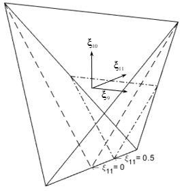
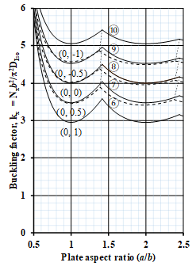
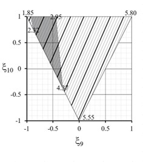
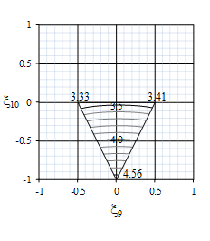

# Project 03 — Lamination Parameter Design Space for compresson bucklng

This project studies the lamination parameter design space of standard quad finite length plates for compresson bucklng.

## Contents
- DESIGN SPACE INTERROGATION

    The database for <em>Bend-Twist</em> coupled designs with up to 21 plies is presented graphically in [Figure 1](#Fig-DesignSpaceDemo). [Figure 1(a)](#PlyPercentageExplaination) represents the lamination parameter design space for extensional stiffness ($\xi_{1}$, $\xi_{2}$) with ply percentage mapping of straight fibre ply orientation. $\xi_{1-4}$ represent the extensional stiffness, $\xi_{5-8}$ represent the coupling (in \& out of plane) stiffness and $\xi_{9-12}$ represent the bending stiffness, each set has its own feasible design region. The lamination parameter point cloud for extensional stiffness is illustrated by 112 points (grey circles) in [Fig. 1(a)](#PlyPercentageExplaination). Here exntensional $\xi_{3}$ = $\xi_{4}$ = 0, the coupling stiffness $\xi_{5-8}$ = 0, and the bending stiffness $\xi_{12}$ = 0, while $\xi_{9}$, $\xi_{10}$ and $\xi_{11}$ are all non-zero. Each of the 112 unique points represents many individual laminate designs sharing the same proportion of standard ply orientations, i.e. 0\textdegree, 90\textdegree and \textpm45\textdegree plies, but with different stacking sequences that result in different bending stiffnesses (i.e. different values of $\xi_{9}$, $\xi_{10}$ and $\xi_{11}$). The larger black triangle in [Fig. 1(a)](#PlyPercentageExplaination) represents the feasible region of the design space when the extensional stiffness is uncoupled (i.e. $A_{16}$ and $A_{26}$ are zero). Note that the 10\% rule has been applied, which means that each design consists of at least 10\% of each of the standard ply orientations, this defines a smaller triangle (a sub-region) within the uncoupled design space corresponding to this constraint. Ply contiguity further constrains the available design space, which is set to a maximum of 3 adjacent plies with the same orientation, as is now common design practice. Ply contiguity is used to prevent ‘ply blocking’, which refers to a large numbers of consecutive repeating plies with the same fibre angle, that would increase the likelihood of delamination occurring. This condition further shrinks the available design space. The smaller black triangle in [Fig. 1(a)](#PlyPercentageExplaination) is defined by the application of both these two types of constraint. The green grid lines represent constant ply percentage values for 0°, 90° and ±45° plies, ranging from 0 to 100\% in intervals of 10\%, where the top, left and right lines of the triangular design space represent purely 0\textdegree, 90\textdegree and \textpm45\textdegree plies respectively. 
    
    To give an example of how to read this graph, the blue point in [Fig. 1(a)](#PlyPercentageExplaination) at ($\xi_{1}$, $\xi_{2}$) = (-0.7, 0.8) contains (0/$\pm$45/90) ply percentages of (10/10/80), as indicated by the green grid lines. Typical locations of aircraft wing skins, spars and stiffeners in this design space are indicated by the red points in [Fig. 1(a)](#PlyPercentageExplaination). [Figure 1(b)](#3DDesignSpaceExplaination) shows 20 points in a three-dimensional design space for bending stiffness defined by $\xi_{9}$, $\xi_{10}$ and $\xi_{11}$. The points are randomly selected from all available designs correspond to the points shown in [Fig. 1(a)](#PlyPercentageExplaination). 

    Finally, [Fig. 1(c)](#New3DSpace_NoPts) shows the location of the planes defined by $\xi_{11}$ = 0 (bounded by the dashed line) and $\xi_{11}$ = 0.5 (bounded by the dashed-dotted line) in the bending stiffness design space. These 2-D cross-sections are used later in later projects, where a 15-point grid of sample points is used to develop closed-form bucking equations. $\xi_{11}$ represents the out-of-plane coupling, with 0.5 being the most extreme value for this type of coupling used by industry. By using this value, the knock-down in buckling performance due to out-of-plane coupling can be assessed, while the size of the design space is reduced, making the optimisation more feasible.

    

    <table style="border:1px solid black; border-collapse:collapse;">
    <tr>
    <td colspan="2" align="center" style="border:1px solid black; padding:8px;">
    
     
      <em>(a)</em>
        </td>
     </tr>
    <tr>
    <td align="center" style="border:1px solid black; padding:8px;">
     
       
      <em>(b)</em>
    </td>
       <td align="center" style="border:1px solid black; padding:8px;">
        
       
        <em>(c)</em>
    </td>
    </tr>
    </table>

    <em><strong>Figure 1.</strong> Lamination design space and corresponding geometric mappings.</em>

    

- BUCKLING PERFORMANCE OF FINITE LENGTH PLATES

    To assess the vast number of designs contained in the laminate database, a closed form solution of compression buckling is necessary. [Equation](#eqn-bucklingCFS) gives:

    

    $$
	  N_x = \pi^2 [D_{11} (\frac{m}{a})^2 + 2(D_{11} + 2D_{66})(\frac{n^2}{b^2}) +D_{22}(\frac{n^4}{b^4})(\frac{a}{m})^2]
    \tag{Eqn. 1}
    $$

    

    from knowledge of the bending stiffness, $D_{ij}$, plate length, $a$, and width, $b$, and the buckling half-wave parameter, $m$ (= 1, 2, 3, ...), which produces the lowest critical force resultant $N_{x}$. 

    And the buckling factor $k_x$ is defined by:

    

    $$
	  k_x = \frac{N_xb^2}{\pi^2D_{Iso}}
    \tag{Eqn. 2}
    $$

    
 

- CONTOUR MAPPING FOR COMPRESSION BUCKLING

    For orthotropic laminates, the following buckling equation, represented by a 2-dimensional, 4th order polynomial, can be solved estimated using buckling loads obtained from the exact closed form buckling solution at 15 equally spaced points across the lamination parameter design space, as illustrated by the example cross section in [Fig. 1(c)](#New3DSpace_NoPts), when $\xi_{11}$ = 0:

    

    $$
	  k_x = c_{1} +c_{2}\xi_{9} +c_{3}\xi_{10} +c_{4}\xi_{9}^2 +c_{5}\xi_{10}^2 +c_{6}\xi_{9}\xi_{10} +c_{7}\xi_{9}^{3} +c_{8}\xi_{10}^{3} +c_{9}\xi_{9}\xi_{10}^{2} +c_{10}\xi_{9}^{2}\xi_{10} +c_{11}\xi_{9}^{4} +c_{12} \xi_{10}^{4} +c_{13}\xi_{9}\xi_{10}^{3} +c_{14}\xi_{9}^{2}\xi_{10}^{2} +c_{15}\xi_{9}^{3}\xi_{10} 
    \tag{Eqn. 3}   
    $$

    

    where $k_x$ is the buckling factor defined by [Eqn. 2](#eq-kx5Points).

    This normalization ensures that buckling factor results are comparable across the design space, since the relative change in buckling factor, $k_x$, is the same as the relative change in the critical force resultant, $N_x$.  In this study, IM7/8552 carbon-fibre/epoxy material is used, with Young’s moduli $E_1$ = 161.0 GPa and $E_2$ = 11.38 GPa, shear modulus $G_{12}$ = 5.17 GPa and Poisson ratio $\nu_{12}$ = 0.38.  

    Mode changes complicate the contour maps for finite length plates. Hence the closed form buckling soluton is no longer a continuous function across the design space. The mode change boundaries must therefore first be determined, and separate equations must be derived for each mode region. To help further understand the buckling mode changes across the lamination parameter design space, classical Garland curves are first presented across a range of aspect ratios ($a/b$) in [Fig. 2](#fig-garland) Garland curves show the relationship between buckling factor and the aspect ratios of laminates. These correspond to simply supported plates subject to uniaxial compression.  Here, the solid black lines represent the buckling load factor of uncoupled laminate designs, whilst the broken black lines represent the buckling load factor when $\xi_{11}$ = 0.5 (corresponding to the limit for practical designs), comparison of the two sets of lines illustrates the effect of introducing a <em>Bend-Twist</em> coupling. The individual curves of [Fig. 2](#fig-garland), with circled labels 1 – 5, and 11 - 15 represent discrete coordinate points along the boundary of the $\xi_{9}$, $\xi_{10}$ lamination parameter design space, while curves 6-10 represent points along the middle line of the $\xi_{9}$, $\xi_{10}$ design space, as indicated by the corresponding label locations in [Fig. 3](#CompressionContour+ModeShape). Points on the same curve also represent points with the same location on design spaces across a range of aspect ratios ($a/b$) from 0.5 to 2.5, the coordinates of the points on the design spaces are indicated by the coordinates under each curve. For example, the lowest curve, curve 1, in  [Fig. 2(a)](#fig-garland-a) represents the buckling factor of laminates with lamination parameters ($\xi_{9}$, $\xi_{10}$) = (-1, 1), in which the $a/b$ = 1.0 case is shown on [Fig. 3(a)](#CompressionContour+ModeShape). The curves are split into 3 separate graphs in [Fig. 2](#fig-garland) to avoid confusion that might be caused by crowding overlapping curves. Fine dotted black lines connect the cusps on the uncoupled ($\xi_{11}$ = 0) and coupled ($\xi_{11}$ = 0.5) curves demonstrate the effect of coupling on the location of mode change in terms of aspect ratio. Only 3 coupled curves with $\xi_{11}$ = 0.5 are presented in [Fig. 3(a)](#CompressionContour+ModeShape) - [Fig. 3(c)](CompressionContour+ModeShape) because the design space shrinks as the value of $\xi_{11}$ increases, therefore no feasible data points are available for points located with $\xi_{10}$ > 0 for $\xi_{11}$ = 0.5.

    

    <table style="border:1px solid black; border-collapse:collapse;">
    <tr>
    <td align="center" style="border:1px solid black; padding:6px;">
      
       
      <em>(a)</em>
    </td>
    <td align="center" style="border:1px solid black; padding:6px;">
      
       
      <em>(b)</em>
    </td>
    <td align="center" style="border:1px solid black; padding:6px;">
      
       
      <em>(c)</em>
    </td>
    </tr>
    </table>

    <em><strong>Figure 2.</strong> Compression buckling Garland curves for $\xi_1 = -0.5$ (solid lines) and $\xi_1=0.5$ (broken lines). The corresponding lamination parameter coordinates $(\xi_1,\xi_2)$ are shown alongside each curve.</em>

    

    

    

    <em><strong>Figure 3.</strong> Compression buckling contours $k_x(=N_xb^2/\pi^2D_{Iso})$ for $\xi_{11}$ = 0.0, with: $a/b$ = 1.0 (left); $a/b$ = 1.5 (middle) and; $a/b$ = 2.0 (right).</em>

    

    [Figure 3](#CompressionContour+ModeShape) illustrates contour maps with different aspect ratios ($a/b$ = 1, 1.5 and 2), where distinct different styles of parallel-line in-fill patterns, represent different buckling mode regions (indicated by the inset images above [Fig. 3](#CompressionContour+ModeShape).  The value of the buckling load for the contours is indicated by the numbers in the figure. Boundaries between these regions correspond to the cusps in [Fig. 2](#fig-garland). The 'mode change line’ (highlighted in one instance in [Fig. 2](#fig-garland) and also in [Fig. 3](#CompressionContour+ModeShape) by a green line) separates two regions representing modes with one and two longitudinal half-waves, i.e. wavelength parameters m = 1 (red lines) and m = 2 (blue lines). Such boundary lines are readily determined whenever the closed-form buckling solution is applicable, by fixing one lamination parameter coordinate and solving for the other by simply equating $N_{x,m=1}$ and $N_{x,m=2}$.  The locations of the mode change at the boundaries correspond to ($\xi_{9}$, $\xi_{10}$) = (-0.567, 0.134) and (-0.691, 1), with buckling factor $k_x$ = 3.86 and 2.95, respectively.  The same procedure can be used to confirm the shape of the mode change line. 

    [Figure 2(a)](#fig-garland-a) represents the buckling factor contour map for constant aspect ratio (a/b = 1.0) plates with uncoupled orthotropic bending stiffness.  Similarly, labels on the Garland curves of [Figs. 2(b)](#fig-garland-b) and [2(c)](#fig-garland-b) correspond to those on the contour maps of [Fig. 3(b)](#CompressionContour+ModeShape) and [3(c)](#CompressionContour+ModeShape) for aspect ratios, $a/b$ = 1.5 and 2.0, respectively.  Hence, for a fixed aspect ratio, the isolines of constant buckling factor, $k_x$, are seen to vary with respect to the lamination parameter coordinates, or bending stiffness, as defined by [Eqn. 2](#eq-bucklingfactor).  
    
    The centre of the contour map represents a fully isotropic laminate, with ($\xi_{9}$, $\xi_{10}$) = (0, 0), and corresponds to curve 8 on [Figs. 2(b)](#fig-garland-b) where $k_x$ = 4.0 for aspect ratio $a/b$ = 1, 2, 3, $\cdots$, $\infty$. The cusps that arise from changes in buckling mode also occur at $a/b$ = $\sqrt{2}$, $\sqrt{6}$, $\cdots$ as in metallic plates.  However, for composite materials, the cusp locations are now strongly influenced by orthotropic bending stiffness properties; and further still by the introduction of <em>Bend-Twist</em> coupling. 

    
    For <em>Bend-Twist</em> coupled laminates, closed form buckling solution is no longer valid and therefore a different approach must be adopted.  Buckling factor ($k_x$) results are established at 15 sample points across the feasible region of the design space, corresponding to the grid point intersections of the triangulation illustrated by the cross-section of [Fig. 1](#New3DSpace_NoPts), from which the coefficients $c_1$ – $c_{15}$ in [Eqn. 2](#eq-bucklingfactor) can then be derived for each buckling mode.  

    The finite element analysis software ABAQUS \cite{abaqus614} was used to generate buckling factor results, using the same relative grid point geometry for any cross-section throughout the lamination parameter design space with constant magnitude of <em>Bend-Twist</em> coupling, $\xi_{11}$. Lamination parameters $\xi_{11}$ = 0 and $\xi_{11}$ = 0.5 are compared in this chapter since these represent the bounds for practical laminate designs. Note that -$\xi_{11}$ and +$\xi_{11}$ yield the same compression buckling factor, $k_x$, hence only +$\xi_{11}$ are given. The process of developing the contour maps is now briefly described with specific reference to [Fig. 3(c)](#CompressionContour+ModeShape), representing plate aspect ratio $a/b$ = 2.0; chosen because it contains four buckling mode regions.  Here, individual buckling contours maps, illustrated in [Fig. 4](#CompressionContour+ModeShape), represent the four modes of interest, each generally requires the calculation of a large number of eigenvalues at each grid point to ensure that the specific modes are found.  The individual contour maps therefore represent continuous functions and, in general, all the coefficients $c_1$ – $c_{15}$ in Eq. \ref{eq:15Points} are non-zero.  [Figure 3(c)](#CompressionContour+ModeShape) is therefore comprised of the shaded regions from each of the individual contour maps, i.e., regions containing the lowest buckling factor contours from any of the four modes. 

    

    <table style="border:1px solid black; border-collapse:collapse;">
    <tr>
    <td align="center" style="border:1px solid black; padding:6px;">
      
       
      <em>(a) m = 1</em>
    </td>
    <td align="center" style="border:1px solid black; padding:6px;">
      
       
      <em>(b) m = 2</em>
    </td>
    <td align="center" style="border:1px solid black; padding:6px;">
      
       
      <em>(c) m = 3</em>
    </td>
    <td align="center" style="border:1px solid black; padding:6px;">
      
       
      <em>(d) m = 4</em>
    </td>
    </tr>
    </table>

    <em><strong>Figure 4.</strong> Compression buckling contours map construction for $a/b$ = 2.0, involving superposition of contour maps for each buckling mode, representing $m$ = 1, 2, 3 and 4 in [Eqn. 1](#eq-bucklingCFS). Shading illustrates the extent of each mode region, corresponding to minimum $k_x$.</em>

    

    Individual points on the boundary lines between mode regions are found from the buckling factor equaton by generating two equations using the coefficients from adjacent mode regions, $m$ and ($m + 1$) and then equating for a fixed lamination parameter $\xi_{10}$, to solve for the variable lamination parameter $\xi_{9}$. Points on the boundary lines were also verified by individually calculating $k_{x, m}$, corresponding to the mode numbers, $m$, of interest, at 5 sample points along edges of the feasible region, from which two simpler polynomial equations of the following general form:

    

    $$ 
    
    k_1=c_{1} +c_{2}\xi_{9} +c_{3}\xi_{9}^2 +c_{4}\xi_{9}^3 +c_{5}\xi_{9}^4 
    \tag{Eqn. 4}
    $$

    

    Points can be generated and equated to reveal the location, $\xi_{9}$, of coincident buckling modes, $k_{x,m}=k_{x,(m + 1)}$. [Equaton 4]{#eq-kx5Points} equation has also been used to generate the lines of each mode boundary in [Fig. 3(c)](#CompressionContour+ModeShape).

    [Figure](#fig-garland) reveals that the mode changes occur at lower aspect ratios for <em>Bend-Twist</em> coupled laminates in comparison to their uncoupled counterparts.  The buckling curves (dotted lines) for <em>Bend-Twist</em> coupled laminates are also seen to descend with increasing aspect ratio and, uniquely for curve 3 with lamination parameter coordinates ($\xi_{9}$, $\xi_{10}$, $\xi_{11}$) = (-0.5, 0, 0.5), ascending curves are also revealed.  This is in stark contrast to the curves for uncoupled laminates (solid lines), for which the lowest point between cusps is always coincident with the asymptotic value, corresponding to the buckling load factor of the infinitely long plate.   

    [Figure 3(a)](#CompressionContour+ModeShape) contains a special comparison between triangular bounds for the standard ply laminates considered in this study and parabolic bounds, corresponding to free form angles, where fibre angles are arbitrary.  For non-standard or free form fibre directions with arbitrary values, the design space changes from a 3-dimensional to a 4-dimensional relationship, which significantly complicates the mapping procedure. There is also a further reduction in the buckling factor when the fibre orientations are changed from standard to non-standard angles, since $\xi_{12}$ becomes non-zero.  This can be demonstrated through a pseudo quasi-homogeneous quasi-isotropic <em>Bend-Twist</em> coupled design: [45/0/90/45/90/-452/0]S for which all lamination parameters are zero, except $\xi_{11}$ = 0.4.  For finite length plates, with aspect ratios $a/b$ = 1.0, 1.5 and 2.0, when the fibre directions are changed from standard \textpm45\textdegree plies to non-standard \textpm30\textdegree (\textpm60\textdegree) plies, the buckling factors are reduced by a further 5.2\% (5.2\%), 4.2\% (12.1\%) and 3.8\% (6.0\%).  However, this is primarily because the lamination parameters representing orthotropic stiffnesses become non-zero, i.e.  ($\xi_{9}$, $\xi_{10}$) = (\textpm0.25, 0.25).  The coupling stiffnesses remain at similar magnitudes: for \textpm30\textdegree, $\xi_{11}$ = $\xi_{12}$ = -0.34 and; for \textpm60\textdegree,\textdegree $\xi_{11}$ = -$\xi_{12}$ = -0.34.  This comparison does not therefore reveal the true influence of $\xi_{12}$.  However, if $\xi_{12}$ is introduced artificially, to give ($\xi_{9}$, $\xi_{10}$, $\xi_{11}$, $\xi_{12}$)= (0, 0, 0.4, \textpm0.4), the resulting buckling factor is reduced by a further 0.6\% (0.5\%), -0.1\% (1.1\%) and -1.9\% (3.5\%) at aspect ratios a/b = 1.0, 1.5 and 2.0, respectively.  

    The choice of aspect ratios presented here was strongly influenced by the plethora of results reported in the literature for isotropic plates which represent only a single point in the centre of the lamination parameter design space.  The square and rectangular plate, with $a/b$ = 2, give identical compression buckling results only when the design is representative of the (equivalent) isotropic laminate, i.e., curve 8 of [Fig. 2(b)](#fig-garland-b), or indeed for square symmetric properties, i.e., curves 6–10 of [Fig. 2(b)](#fig-garland-b). The results are also identical to the lower-bound solution corresponding to the infinitely long plate. For <em>Bend-Twist</em> coupled designs, there is a very large difference in the degradation in buckling load between these two aspect-ratios, as shown by curve 13 of [Fig. 2(c)](#fig-garland-c).  
  
    The rectangular plate configuration with $a/b$ = 1.5 is also commonly presented in this chapter. However, this aspect ratio has special significance in composite materials testing because of the requirement for compression strength after impact assessment in the ASTM standard, with an anti-buckling requirement and for which the boundary conditions of the test are simple supports. The ASTM guidelines recommend a stacking sequence of: [45/0/-45/90]rS, , but the variable number of repeats, $r$ = 1, 2, 3, $\cdots$, can be seen to possess significantly varying magnitude of <em>Bend-Twist</em> coupling, i.e., ($\xi_9$, $\xi_{10}$, $\xi_{11}$) = (0.28, -0.38, 0.47), (0.16, -0.19, 0.21) and (0.12, -0.13, 0.14), respectively. 

    Finally, [Fig. 5(b)](#fig-CompressionBucklingContourXi11=0_5) represents the buckling factor contour map for constant aspect ratio ($a/b$ = 1.0, 1.5 and 2.0) plates with <em>Bend-Twist</em> coupled orthotropic bending stiffness where $\xi_{11}$ = 0.5. The buckling performances of <em>Bend-Twist</em> coupled laminates across different aspect ratios is illustrated in [Fig. 2](#fig-garland). The Garland curves for the coupled plates are related to the curves with the same $\xi_9$, $\xi_{10}$ design space cross section coordinates but uncoupled ($\xi_{11}$ = 0) with dotted lines. [Figure 5(b)](#fig-CompressionBucklingContourXi11=0_5) also reveals that the <em>Bend-Twist</em> coupled laminates have reduced buckling performances compared to uncoupled laminates with the same location in the design space.  

    

    <table style="border:1px solid black; border-collapse:collapse;">
    <tr>
    <td align="center" style="border:1px solid black; padding:6px;">
      
       
      <em>(a)</em>
    </td>
    <td align="center" style="border:1px solid black; padding:6px;">
      
       
      <em>(b)</em>
    </td>
    <td align="center" style="border:1px solid black; padding:6px;">
      
       
      <em>(c)</em>
    </td>
    </tr>
    </table>

    <em><strong>Figure 5.</strong> Compression buckling contours, $k_x(=N_xb^2/\pi^2D_{Iso}$, for $\xi_{11}$ = 0.5 with: (a) $a/b$ = 1.0; (b) $a/b$ = 1.5 and (c) $a/b$ = 2.0.</em>

    

    