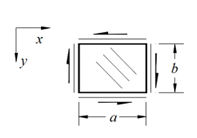
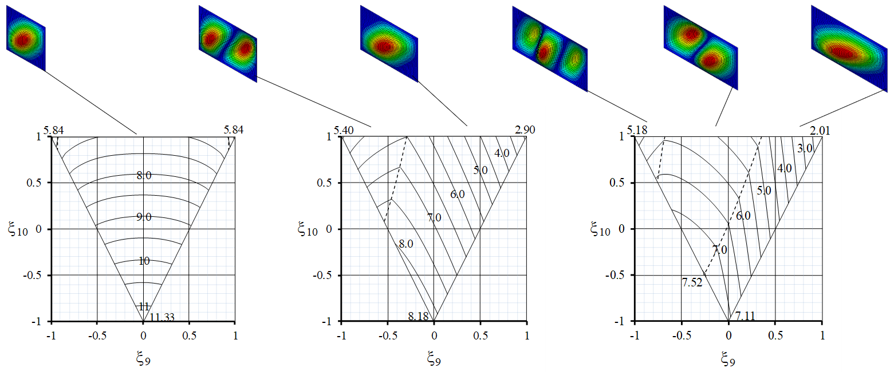
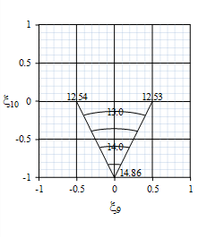
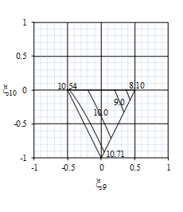
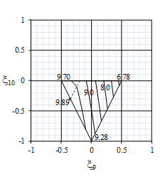
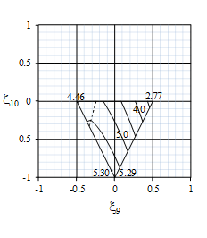
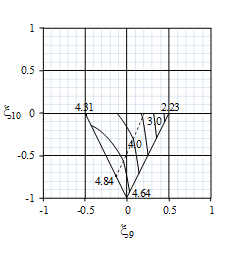

# Project 03 — Lamination Parameter Design Space for shear bucklng

This project studies the lamination parameter design space of standard quad finite length plates for shear bucklng.

## Contents

Equations for shear loaded plates are obtained using the same procedure adopted for compression buckling.  However, the finite element analysis software ABAQUS must now be used for uncoupled as well as coupled designs to generate buckling factors. The plate axis system, positive shear load, positive fibre orientation with respect to the x-axis, and aspect ratio ($a/b$) are also defined in the thumbnail sketch in [Fig. 1](#Plate_axis_system).

 

<em><strong>Figure 1.</strong> Illustration of the plate axis system, positive shear load, positive fibre orientation with respect to the x-axis, and aspect ratio ($a/b$).</em>

For the uncoupled laminates, positive and negative shear give identical buckling load factors. The shear buckling factors are obtained by substituting the calculated coefficients into Eqn. \ref{eq:bucklingCFS}. In this case, $k_{xy}$ is defined by: 

$$
K_{xy}=\frac{N_{xy}b^2}{\pi^2D_{Iso}}
\tag{Eqn. 1}
$$

 

<em><strong>Figure 2.</strong> Positive and Negative Shear buckling factor contours, $k_{xy}(= N_{xy}b^2/\pi^2D_{Iso})$, for $\xi_{11}$ = 0.0 with: (a)  $a/b$ = 1.0; (b) $a/b$ = 1.5, and (c) $a/b$ = 2.0.</em>

<table style="border:1px solid black; border-collapse:collapse;">
    <tr>
    <td align="center" style="border:1px solid black; padding:6px;">
      
       
      <em>(a)</em>
    </td>
    <td align="center" style="border:1px solid black; padding:6px;">
      
       
      <em>(b)</em>
    </td>
    <td align="center" style="border:1px solid black; padding:6px;">
      
       
      <em>(c)</em>
    </td>
    </tr>
</table>
    <em><strong>Figure 2.</strong> Negative Shear buckling contours $k_{xy}(=N_{xy}b^2/\pi^2D_{Iso})$ for $\xi_{11}$ = 0.0, with: $a/b$ = 1.0 (left); $a/b$ = 1.5 (middle) and; $a/b$ = 2.0 (right).</em>

    <table style="border:1px solid black; border-collapse:collapse;">
    <tr>
    <td align="center" style="border:1px solid black; padding:6px;">
      
       
      <em>(a)</em>
    </td>
    <td align="center" style="border:1px solid black; padding:6px;">
      
       
      <em>(b)</em>
    </td>
    <td align="center" style="border:1px solid black; padding:6px;">
      
       
      <em>(c)</em>
    </td>
    </tr>
</table>
    <em><strong>Figure 2.</strong> Positive Shear buckling contours $k_{xy}(=N_{xy}b^2/\pi^2D_{Iso})$ for $\xi_{11}$ = 0.0, with: $a/b$ = 1.0 (left); $a/b$ = 1.5 (middle) and; $a/b$ = 2.0 (right).</em>

