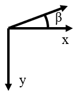

# Project 04 — Double angle-ply laminates (Double-double, DD)

The aim of the work in this project is to apply knowledge from Project 1 to 3 to explore the first ply failure (FPF) performance of composite
laminates with double-angle, as opposed to standard angle-ply configurations.

## Introducton

‘Double angle-ply laminates’. Conventional laminates usually incorporate just 4 ply-angles (quad laminates), namely, 0°, 90° \space and $\pm$45°, which has limited design space. The design of conventional laminates in industry typically follows a number of rules \cite{Bailie1997,york&almeida2018bt}: (i) mid-plane symmetric to prevent thermal warping; (ii) balanced to prevent any mechanical couplings, (iii) the 10 percent rule, which means that each of the 4 plies must take up at least 10\% of the total number of plies and (iv) ply contiguity of no more than 3 plies, to reduce delamination.

A new layup method of composite laminate was introduced by Tsai in 2017, called double angle-ply, or double-double (DD) laminates  \cite{Tsai2017book}. A DD laminate is a novel idea for designing laminates involving two pairs of sub-laminates. These replace conventional fixed ply angles (i.e. 0°, 90°, ±45°), in which the two pairs of fibre angles can theoretically be arbitrary. DD laminates offers great potential for improvements over standard quad laminates, as listed below:

- DD laminates have been shown to offer potential improvements in first ply failure strength \cite{Tsai2017keynote}
- Rather than being limited to 4 fixed angles for standard quad designs, $\phi$ and $\psi$ in DD laminates can be any arbitrary angle between 0° to 90°. This offers a significantly larger design space compared to standard ply laminates.
- Ease of manufacturability: DD plies enhance the compatibility between the sub-laminates, which reduces the chance of wrinkle defects during the forming process, hence a higher production rate and lowering the requirement of manufacturing knockdown factors \cite{Nielsen2017}.
- As $\phi$ and $\psi$ can be arbitrary angles, unlike the set angles found in quads, the fibre potential is allowed to be utilised fully with optimised combinations. Less layers are therefore needed to obtain the same performance as standard laminates of the same mass, which means reductions in the weight of the resulting structure \cite{Vermes2021}.
- Mid-plane symmetric is not required with DD laminates because $\phi$ and $\psi$ always comes with a positive and negative pair and always repeats, which allows DD laminates to be homogenised more quickly than standard quad laminates \cite{Vermes2021-2,tsai2021dd}. A homogenised laminate refers to a laminate that has repeated properties throughout its thickness.
- The design and manufacture processes of homogenised laminates is simple, tailoring is also more straightforward and less prone to delamination \cite{Tsai2019book}.
- Layup speed of DD laminates can be up to 6 times quicker than quad laminates and with less scrap \cite{Tsai2019book}.
- Tapering can be achieved using a single ply drop-off at each step, rather than two drop-offs, as required with quad laminates \cite{Tsai2019book}.
- Ply termination of a DD laminate can be done anywhere on the laminate \cite{Tsai2019book}.
- DD laminates have a less serious problem of blending \cite{Tsai2019book}, which refers to a design methodology where a panel or laminate is divided into different regions, single ply drop off is allowed from one region to the adjacent region according to the load concentration of each region \cite{Kristinsdottir2001}.
- More aggressive tapering can be achieved, up to a ratio of 10:1 between the centre and the edge. This can lead to further weight savings \cite{Shrivastava2020,Tsai2017book}.

Double angle ply laminates utilize the same design techniques as standard laminates and the lamination parameters method can also be used for optimisation. Here the stacking sequence can be determined from the desired lamination parameters coordinates, i.e. the position within a lamination parameter design space. Moreover, the required lamination parameter values can be determined by stiffness matching;  matching the lamination parameter coordinates of standard -ply designs for extensional ($\xi_{1-4}$) and bending stiffness ($\xi_{9-10}$) with those of DD laminates. For example, York used a stiffness matching approach to design double angle ply laminates and compared these with standard quads and also performed buckling analysis on the double angle ply laminates \cite{york2020}. Here, lamination parameters were used for optimisation of the buckling performance of the DD laminates. 

## MOTIVATION TO DOUBLE ANGLE-PLY LAMINATES

Aero-elastic tailoring of composite wings is expected to lead to a valuable drag reduction mechanism in conventional swept back wings \cite{Jutte2014}, by reducing any fluctuation away from the optimized static cruise configuration, i.e., reducing the magnitude of wing-twist as it bends.  Drag reduction can be achieved by introducing passive <em>Bend-Twist</em> coupling behaviour (a so-called passive-adaptive wing), to maintain a constant angle of attack across the wing, irrespective of the magnitude of the bending deflection \cite{York2018pawing}. This has been demonstrated for a number of competing laminate tailoring techniques. To create a <em>Bend-Twist</em> coupled behaviour Extension-Shear coupled properties are usually required and achieved by including off-axis fibre orientations in the layup. Off-axis alignment ($\beta$) refers to an angle away from the x-y axes, where the latter are defined by the direction of loading, as illustrated in Fig. \ref{figure:OffAxisAlignmentr}. The focus of the previous chapters has, thus far, been restricted to buckling behaviour. The effect of such tailoring on laminate first ply failure performance is now also considered to examine the feasibility of this tailoring method. This is assessed by combining buckling predictions with material strength constraints.

 

<em><strong>Figure 1.</strong> Illustration of the off-axis alignment on the x-y axis.</em>

Studies on buckling optimisation of composite laminates subject to material strength constraints are summarised elsewhere  \cite{gurdal1999}. Their purpose is to reduce the feasible design region and obtain stacking sequences for specific design applications. Material strength constraints are applied either through a maximum limit on laminate strain or via individual ply stresses \cite{York2006}. This includes methods for determining optimal stacking sequences to maximise buckling load \cite{Deveci2016}. This includes methods for determining optimal stacking sequences to maximise buckling load \cite{Lopez2009}.

Very few studies have previously been conducted on the assessment of buckling, subject to material strength constraints, for off-axis aligned laminates possessing <em>Extension-Shear</em> coupling behaviour \cite{Stodleck2017_OffAxis}. The objective of this study is therefore to explore the available design space for a number of design solutions, including both DD and standard laminates. Off-axis orientation (with respect to the loading direction) is applied to both types of laminate to introduce Extension-Shear coupling, and also to standard designs that already possess an Extension-Shear coupling without the requirement for off-axis alignment.  Laminate designs are matched for buckling load, with off-axis alignments that give maximum <em>Extension-Shear</em> coupling, and material strength assessment is then made. 

The introduction of passive <em>Bend-Twist</em> coupling at the wing-box level has been demonstrated \cite{Jutte2014} Shear coupling at the laminate level, i.e., in the wing skins. However, there is a limited design space for standard ply laminates with <em>Extension-Shearing</em> coupling \cite{York2015es} (with 0°, $\pm$45° and 90° ply orientations).  By contrast, a substantial design space exists for laminates that possess both <em>Extension-Shearing and Bending-Twisting</em> coupling \cite{York2017a}, yet care must be exercised since the presence of Bend-Twist coupling leads to a significant reduction in buckling load \cite{York2017bt}.

DD laminates have been shown to offer potential improvements in material strength \cite{Tsai2017keynote}, together with ease of manufacturability \cite{Nielsen2017}, when compared to standard ply laminates.  However, little consideration has been given to bending stiffness. 

The normal practice of choosing the extensional stiffness first, typically by applying certain ply percentages, offers the possibility of shuffling the stacking sequence, within the constraints of the symmetric design rule for standard laminates, to optimise the buckling performance.  However, this usually leads to the introduction of a Bend-Twist coupling behaviour which, more often than not, leads to a penalty in the buckling load.  The methodology adopted here instead imposes a desired buckling load to match a required laminate strength target.

## Methodology

The development of a passive adaptive <em>Bend-Twist</em> coupled wing requires Extension-Shear coupled laminate skins \cite{York2018pawing}, these can be achieved in several ways. The following types of laminates are used for the design process:

- off-axis fibre alignment ($\beta$) of otherwise balanced and symmetric laminates with standard ply orientations  (0°, \textpm45° and 90°)
- Off-axis orientation of double angle-ply (DD) ($\pm\phi°$ and $\pm\psi°$) laminates, with otherwise <em>Uncoupled</em> properties
- <em>Extension-Shear</em> coupled (only) laminates with standard ply orientations

A non-symmetric isotropic laminate configuration with standard ply orientations is also used as a datum to compare against the coupled designs, as this laminate is fully isotropic, i.e. $\xi_{1-12}$ = 0 and has a classic compressive buckling factor of 4.0. 

[45/90/0/-45/0/-45/90/-45/45/0/45/90/45/90/-45/90/0/45/0/-45/0/-45/45/90]T

where the subscript T represents a complete laminate stacking sequence.

The designs are fixed to 24-plies, which represents the minimum ply number grouping for $\pi/4$ bending isotropy \cite{Vannnucci_ISO2002,york2020}.

The balanced and symmetric design has the stacking sequence:

[-45/45/0_3/45/0/-45/0/90/0/90]S

This stacking sequence is selected from the 24-ply laminate database, since it produces the highest <em>Extension-Shear</em> coupling, measured as $A_{16}$/$A_{11}$ = 21.9\% at off-axis orientation of $\beta$= 37.3°.  Note that the application of off-axis alignment also introduces the non-zero lamination parameters, $\xi_3$ and $\xi_4$, giving ($\xi_1$, $\xi_2$, $\xi_3$, $\xi_4$) = (0.09, -0.29, 0.32, 0.17).  Without off-axis alignment, the lamination parameters ($\xi_1$, $\xi_2$) = (0.33, 0.33). 

For the DD designs, a new design methodology is adopted \cite{York2018dd}. A technique to match the bending stiffness between standard ply laminates (with 0°, \textpm45° and 90° fibre directions) and DD laminates (with $\pm\phi°$ and $\pm\psi°$ fibre directions) is used. The conventional fibre directions, 0°, 90° and \textpm45° are replaced with $\pm\phi_\gamma$ and $\pm\psi_{1-\gamma}$ pairs, where $\gamma$ represents the proportion of $\pm\phi$, and ($1-\gamma$) represents the proportion of $\pm\psi$.  For extension stiffness matching, these proportions correspond to the $\pm\phi$ and $\pm\psi$ ply percentages. For bending stiffness matching, the proportions correspond to the relative contribution to bending stiffness of $\pm\phi$ and $\pm\psi$ plies in the laminate. The formulation of stiffness matching  recap is provideed here. The relative contribution to bending stiffness of the $\pm\phi$ ply sub-laminate in terms of lamination parameters is given by:

$$
	\zeta_{\pm\phi} = (\xi_{9}-\beta)(\alpha-\beta) \tag{Eqn. 1} 
$$

$$
	\alpha = \cos2\phi, \qquad 
	\beta = \cos2\psi \tag{Eqn. 2}
$$

where $\alpha$ and $\beta$ can be expressed in the form of a quadratic equation:

$$
	\beta=-\frac{\xi_{10}+1-2\alpha^2}{4(\alpha-\xi_9)}+\sqrt{(\frac{\xi_{10}+1-2\alpha^2}{4(\alpha-\xi_9)})^3-\frac{2\alpha^2\xi_9-\alpha-\xi_{10}\alpha}{2(\alpha-\xi_9)}}
	\tag{Eqn. 3}
$$

which leads to a solution for angle $\phi$ from  [Eqn. 2](#eq:alpha&beta) (solved iteratively), then [Eqns. 1](#eq:zetaphi) and [2](#eq:BetaFinal) are matched for the desired lamination parameters ($\xi_{9}$, $\xi_{10}$).  Finally, a solution for angle $\psi$ is obtained directly from [Eqn. 2](#eq:alpha&beta), once the iterative process has converged. 

Stacking sequences, lamination parameters and angles $\phi$ and $\psi$ from a previous study \cite{York2018dd} are listed in  Table \ref{Table:SSofa-f}. The angles were derived from [Eqn. 1](#eq:zetaphi) – [2](#eq:BetaFinal) for ($\xi_{9}$, $\xi_{10}$ = (0, 0).

  | Design | Stacking Sequence |  $\psi°$,  $\phi°$ |  
  |:---:|:---:|:---:|  
  | a | [  $\psi$/  $\psi$/ $-\phi$/  $\phi$/  $\phi$/ $-\phi$/  $\phi$/ $-\phi$/ $-\phi$/  $\phi$/ $-\psi$/  $\psi$/ $-\psi$/  $\psi$/  $\phi$/ $-\phi$/ $-\phi$/  $\phi$/ $-\phi$/  $\phi$/  $\phi$/ $-\phi$/  $\psi$/ $-\psi$]T | 63.78, 17.44 |  
  | b | [ $\psi$/- $\psi$/- $\phi$/- $\phi$/- $\phi$/ $\phi$/- $\phi$/ $\phi$/- $\psi$/ $\psi$/ $\phi$/- $\phi$/ $\phi$/- $\phi$/- $\psi$/ $\psi$/- $\phi$/ $\phi$/- $\phi$/ $\phi$/ $\phi$/- $\phi$/ $\psi$/- $\psi$]T | 65.08, 19.58 |  
  | c | [ $\psi$/- $\psi$/- $\phi$/ $\phi$/ $\phi$/- $\phi$/- $\psi$/ $\psi$/ $\phi$/- $\phi$/- $\phi$/ $\phi$/ $\phi$/- $\phi$/- $\phi$/ $\phi$/- $\psi$/ $\psi$/- $\phi$/ $\phi$/ $\phi$/- $\phi$/ $\psi$/- $\psi$]T | 68.08, 23.04 |  
  | d | [ $\psi$/- $\psi$/- $\phi$/ $\phi$/- $\psi$/ $\psi$/ $\phi$/- $\phi$/ $\phi$/- $\phi$/ $\phi$/- $\phi$/- $\phi$/ $\phi$/- $\phi$/ $\phi$/- $\phi$/ $\phi$/- $\psi$/ $\psi$/ $\phi$/- $\phi$/ $\psi$/- $\psi$]T | 74.28, 27.06 |  
  | e | [ $\psi$/- $\psi$/ $\phi$/- $\phi$/- $\phi$/ $\phi$/ $\psi$/- $\psi$/- $\psi$/ $\psi$/- $\psi$/ $\psi$/- $\psi$/ $\psi$/- $\psi$/ $\psi$/ $\psi$/- $\psi$/- $\phi$/ $\phi$/ $\phi$/- $\phi$/ $\psi$/- $\psi$]T | 70.46, 24.95 |  
  | f | [ $\psi$/- $\psi$/ $\phi$/- $\phi$/ $\psi$/- $\psi$/- $\phi$/ $\phi$/- $\psi$/ $\psi$/- $\psi$/ $\psi$/- $\psi$/ $\psi$/- $\psi$/- $\phi$/ $\phi$/ $\psi$/- $\psi$/ $\phi$/- $\phi$/ $\psi$/- $\psi$]T | 78.64, 28.59 |  
<em><strong>Table 1.</strong> Stacking sequences for fully uncoupled double angle-ply laminates with 24 layers.  The listed angles ($\phi$, $\psi$) produce bending isotropy.</em>

The <em>Extension-Shearing</em> coupled laminate with standard ply orientations: 

[-45/0/45/90/90/0/45/45/-45/45/90/45/45/90/45/-45/45/90/45/0/45/0/90/-45]T

was derived using an algorithm developed previously \cite{York2015es}.  The design has a maximum $A_{16}/A_{11}$ of 16.7\%, without off-axis alignment, $\beta$, and shares the same compression buckling load, N\textsubscript{x}, as the isotropic plate, as can be readily confirmed from the closed form solution, given that the design is fully uncoupled in bending, i.e., $D_{16}=D_{26}=0$. For convenience, the equation is provided here again: 

$$
	N_x = \pi^2 [D_{11} (\frac{m}{a})^2 + 2(D_{11} + 2D_{66})(\frac{n^2}{b^2}) +D_{22}(\frac{n^4}{b^4})(\frac{a}{m})^2]
	\tag{Eqn. 3}
$$

where $a$ and $b$ are the length and width of the laminate, $m$ is the number of half-waves of the buckling mode along the plate length and $D_{ij}$ are the elements of the bending stiffness matrix [D]. The lamination parameter is generally given by Eqn. \ref{eq:ABDfromLP} in Chapter \ref{Chapter:Introduction}, ), though for double angle-plies, the equation is adjusted slightly to:

$$
\begin{align}
	\xi_1 &= \frac{n_\phi\cos2\theta_{\phi}+n_{\psi}\cos2\theta_{\psi}}{n}, \qquad
	\xi_2=\frac{n_{\phi}\cos4\theta_{\phi}+n_{\psi}\cos4\theta_{\psi}}{n} \\
	\xi_3&=\frac{n_{\phi}\sin2\theta_{\phi}+n_{\psi}\sin2\theta_{\psi}}{n}, \qquad
	\xi_4=\frac{n_{\phi}\sin4\theta_{\phi}+n_{\psi}\sin4\theta_{\psi}}{n} \\
	\xi_9&=\frac{\zeta_{\phi}\cos2\theta_{\phi}+\zeta_{\psi}\cos2\theta_{\psi}}{\zeta}, \qquad
	\xi_{10}=\frac{\zeta_{\phi}\cos4\theta_{\phi}+\zeta_{\psi}\cos4\theta_{\psi}}{\zeta} \\
	\xi_{11}&=\frac{\zeta_{\phi}\sin2\theta_{\phi}+\zeta_{\psi}\sin2\theta_{\psi}}{\zeta}, \qquad
	\xi_{12}=\frac{\zeta_{\phi}\sin4\theta_{\phi}+\zeta_{\psi}\sin4\theta_{\psi}}{\zeta}
\end{align}
\tag{Eqn. 4}
$$

where $\zeta=n^3$.

The Tsai-Wu failure criteria \ref{eq:TW} is used for the strength assessment and is defined by: 

$$
	F_{1}\sigma_1+2F_{2}\sigma_2+F_{11}\sigma_1^2+F_{22}\sigma_2^2+F_{66}\tau_{12}^2-\sqrt{F_{11}F_{22}}\sigma_1\sigma_2 = 1 			
	\tag{Eqn. 5}
$$

where

$$
\begin{align}
	F_{1} &= \frac{1}{\sigma_1^T}+\frac{1}{\sigma_1^C}, \qquad
	F_{2} = \frac{1}{\sigma_2^T}\frac{1}{\sigma_2^C} \\
	F_{11} &= -\frac{1}{\sigma_1^T\sigma_1^C}, \qquad
	F_{22} = -\frac{1}{\sigma_2^T\sigma_2^C}, \qquad
	F_{66} = (\frac{1}{\tau_{12}^F})^2 \notag	
\end{align}
\tag{Eqn. 6}
$$

Individual terms correspond to the strength data listed in [Table 2](#Table:T300-5208EngineeringProperties} for the T300/5208 graphite/epoxy material adopted in this study. 

  | Property | Value | Strength type | Value |  
  |:---:|:---:|:---:|:---:|  
  | $E_1$ (GPa) | 181.0 | $\sigma_1^T$ | 1500 |  
  | $E_2$ (GPa) | 10.3 | $\sigma_1^C$ | -1500 |  
  | $G_{12}$ (GPa) | 7,17 | $\sigma_2^T$ | 40 |  
  | $\nu_{12}$ | 0.28 | $\sigma_2^C$ | -246 |  
  | | | $\tau_{12}$ | 68 |  
  <em><strong>Table 2.</strong> Engineering properties of T300/5208 graphite/epoxy.</em>

where $\sigma_{1T}$, $\sigma_{1C}$, $\sigma_{2T}$ and $\sigma_{2C}$ represent the allowable le tensile and compression stress values in the principal coordinate system, and $\tau_{12F}$ represents the allowable in-plane shear stress value.

The stiffness matching approach is now extended to simultaneously match both first ply failure and buckling load constraints, for a chosen DD laminate with maximised  <em>Extension-Shear</em> coupling. 

The results presented are based on compression buckling load, $N_x$, of a rectangular, simply supported plate with fixed aspect ratios, $a/b$, which for the uncoupled designs adopted here, allows the use of the closed form buckling solution given by Eqn. \ref{eq:bucklingCFS}. The procedure involves simultaneously matching the load for both buckling and first ply failure, from which the physical plate dimensions $a$ and $b$ can be determined.