# Project 5 — First-ply Failure of a Composite Plate

This project follows Project 4 and evaluates the first-ply failure of the 6 DD laminate designs.

## Geometry setup
  - Plate dimensions: 300 mm × 300 mm
  - Shell modelling (S8R5 elements)
  - Number of ply: 24
  - Ply thickness: 0.1397 mm 
- Material properties  
  **Graphite/epoxy T300/5208**  

  | Property | Value | Strength type | Value |  
  |:---:|:---:|:---:|:---:|  
  | $E_1$ (GPa) | 181.0 | $\sigma_1^T$ | 1500 |  
  | $E_2$ (GPa) | 10.3 | $\sigma_1^C$ | -1500 |  
  | $G_{12}$ (GPa) | 7,17 | $\sigma_2^T$ | 40 |  
  | $\nu_{12}$ | 0.28 | $\sigma_2^C$ | -246 |  
  | | | $\tau_{12}$ | 68 |  

- Layup  

  | Design | Stacking Sequence |  $\psi°$,  $\phi°$ |  
  |:---:|:---:|:---:|  
  | a | [  $\psi$/  $\psi$/ $-\phi$/  $\phi$/  $\phi$/ $-\phi$/  $\phi$/ $-\phi$/ $-\phi$/  $\phi$/ $-\psi$/  $\psi$/ $-\psi$/  $\psi$/  $\phi$/ $-\phi$/ $-\phi$/  $\phi$/ $-\phi$/  $\phi$/  $\phi$/ $-\phi$/  $\psi$/ $-\psi$]T | 63.78, 17.44 |  
  | b | [ $\psi$/- $\psi$/- $\phi$/- $\phi$/- $\phi$/ $\phi$/- $\phi$/ $\phi$/- $\psi$/ $\psi$/ $\phi$/- $\phi$/ $\phi$/- $\phi$/- $\psi$/ $\psi$/- $\phi$/ $\phi$/- $\phi$/ $\phi$/ $\phi$/- $\phi$/ $\psi$/- $\psi$]T | 65.08, 19.58 |  
  | c | [ $\psi$/- $\psi$/- $\phi$/ $\phi$/ $\phi$/- $\phi$/- $\psi$/ $\psi$/ $\phi$/- $\phi$/- $\phi$/ $\phi$/ $\phi$/- $\phi$/- $\phi$/ $\phi$/- $\psi$/ $\psi$/- $\phi$/ $\phi$/ $\phi$/- $\phi$/ $\psi$/- $\psi$]T | 68.08, 23.04 |  
  | d | [ $\psi$/- $\psi$/- $\phi$/ $\phi$/- $\psi$/ $\psi$/ $\phi$/- $\phi$/ $\phi$/- $\phi$/ $\phi$/- $\phi$/- $\phi$/ $\phi$/- $\phi$/ $\phi$/- $\phi$/ $\phi$/- $\psi$/ $\psi$/ $\phi$/- $\phi$/ $\psi$/- $\psi$]T | 74.28, 27.06 |  
  | e | [ $\psi$/- $\psi$/ $\phi$/- $\phi$/- $\phi$/ $\phi$/ $\psi$/- $\psi$/- $\psi$/ $\psi$/- $\psi$/ $\psi$/- $\psi$/ $\psi$/- $\psi$/ $\psi$/ $\psi$/- $\psi$/- $\phi$/ $\phi$/ $\phi$/- $\phi$/ $\psi$/- $\psi$]T | 70.46, 24.95 |  
  | f | [ $\psi$/- $\psi$/ $\phi$/- $\phi$/ $\psi$/- $\psi$/- $\phi$/ $\phi$/- $\psi$/ $\psi$/- $\psi$/ $\psi$/- $\psi$/ $\psi$/- $\psi$/- $\phi$/ $\phi$/ $\psi$/- $\psi$/ $\phi$/- $\phi$/ $\psi$/- $\psi$]T | 78.64, 28.59 |  
  
- Loading & Boundary conditions
  - Axial compression 
  - Simply supported

## Failure Criteria
  1. Max stress  
  The maximum stress criterion predicts the failure of a laminate by looking into the stresses individually, interactions between the tension and compressive stresses are ignored. 

  

	$$
	\begin{aligned}  
	  \frac{\sigma_1}{\sigma_{X_t}} \text{or} \frac{\sigma_1}{\sigma_{X_c}} &= 1 \\  
    \text{or} \\  
	  \frac{\sigma_2}{\sigma_{Y_t}} \text{or} \frac{\sigma_2}{\sigma_{Y_c}} &= 1 \\  
	  \text{or} \\  
  	\frac{|\sigma_6|}{\sigma_Q} &= 1  
	\end{aligned}  
	$$

  

  2. Max Strain  
  The maximum strain criterion function is similar to the maximum stress criterion, but instead of stresses, this approach uses strains to predict the failure strength of a laminate.

  

  $$
  \begin{align}
		\frac{\varepsilon_1}{\varepsilon_{X_t}} \; \text{or} \; \frac{\varepsilon_1}{\varepsilon_{X_c}} &= 1 \\
		\text{or}	\\
		\frac{\varepsilon_2}{\varepsilon_{Y_t}} \; \text{or} \; \frac{\varepsilon_2}{\varepsilon_{Y_c}} &= 1	\\
		\text{or}	 \\
		\frac{|\varepsilon_6|}{\varepsilon_Q} &= 1	
	\end{align}
  $$

  

  3. Puck-Modified  
  The Puck-modified criterion is an updated version of the simple Puck criterion. The modified version considers interactions between the stress in compression and in tension, normal to the fibre direction.  

  

  $$
  \begin{align}
		\frac{\sigma_1}{X_t} \; \text{or} \; \frac{\sigma_1}{X_c}	&= 1 \\
		\text{or} \\
		\frac{\sigma_2^2}{Y_tY_c}+\sigma_2(\frac{1}{Y_t}-\frac{1}{Y_c})+(\frac{\sigma_6}{Q})^2 &= 1
	\end{align}
  $$

  

  
  <!--
  4. Hashin-Rotem
  The Hashin-Rotem failure criterion considers the matrix and fibre failure modes separately. Interactions between the various stress components are also considered.  

  

  $$
  \begin{align}
		\text{Fibre failure:} \; \frac{\sigma_1}{X} &= 1	\\	
		\text{Matrix failure:} \; (\frac{\sigma_2}{Y})^2+(\frac{\sigma_6}{Q})^2 &= 1	
	\end{align}
  $$

  

  5. Hashin  
  The Hashin failure criterion is a modification of Hashin-Rotem criterion, which involves the interactions between the stresses for both fibre and matrix failure.  
  

  $$
  \begin{align}
    \text{Fibre failure in tension:} \; (\frac{\sigma_1}{X_t})^2+(\frac{\sigma_6}{Q})^2 &= 1	\\	
	  \text{Fibre failure in compression:} \; \frac{\sigma_1}{X_t} &= 1	\\
	  \text{Matrix failure:} \; (\frac{\sigma_2}{Y_t})^2+(\frac{\sigma_6}{Q})^2 &= 1
  \end{align}
  $$

	

  -->

  4. Tsai-Wu  
  Compared to the independent and partially-interactive criteria, the Tsai-Wu criterion gives a more comprehensive prediction by considering the interaction between the compressive and tensile strengths. However, the criterion does not indicate whether the laminate failure occurs in the fibre or matrix material. Like the previously mentioned criteria, the Tsai-Wu criterion is predicted using a single expression. Moreover, assumptions are made to generalise the von Mises criterion, giving the A12} term.  
  
  

  $$
  F_{1}\sigma_1+2F_{2}\sigma_2+F_{11}\sigma_1^2+F_{22}\sigma_2^2+F_{66}\tau_{12}^2-\sqrt{F_{11}F_{22}}\sigma_1\sigma_2 = 1
  $$

  

  5. Tsai-Hill  
  Similar to the Tsai-Wu criterion, the Tsai-Hill criterion determines the strength with one single expression, without indicating whether the failure occurs in the fibre or matrix material. The Tsai-Hill criteria is applicable to the case of a single homogeneous orthotropic layer.  
  
  

  $$
  (\frac{\sigma_1}{X})^2-\frac{\sigma_1\sigma_2}{X^2}+(\frac{\sigma_2}{Y})^2+(\frac{\sigma_6}{Q})^2 = 1
  $$

  

  6. Puppo-Evensen Criterion  
  The Puppo-Evensen criterion is proposed to carry out strength assessment for an entire laminate, although it can also be utilized for a single layer. The criterion considers a more thorough interaction between the tensile and compressive stress than the Tsai-Hill criterion and requires simpler testing requirements than the Tsai-Wu criterion. However, adjustments are needed according to the sign of the stresses, which makes it more cumbersome to use than the Tsai-Wu failure criterion.
  
  

  $$
  \begin{align}
    (\frac{\sigma_1}{X})^2-\phi\frac{X\sigma_1\sigma_2}{X^2Y}+\phi(\frac{\sigma_2}{Y})^2+(\frac{\sigma_6}{Q})^2 &= 1  
    \text{where}  
    \phi = \frac{3Q^2}{X_tY_t}
  \end{align}
  $$

  

- Results  

The compressive load ($N_x$), given by the closed form buckling equation from Project Eqn. \ref{eq:bucklingCFS}, corresponding to the minimum first ply failure after off-axis orientation, is used to normalise all the polar plots that follow. 

The first ply failure strength across the lamination parameter design spaces for extensional stiffness DD laminate design <strong><em>d</em></strong> is presented as a bubble plot in Figure \ref{figure:LaminateDBubblePlot}, which will be used later on to show the potential improvements for other designs. The size of the bubble is proportional to the FPF strength value, which is normalised against the FPF load of $\phi$ and $\psi$ = 0° \ degree (5027 N/mm), i.e. a unidirectional laminate. This means that the stronger the design is in terms of FPF, the larger the bubble is. The full-size bubble (= 1.0) of the 0° \ laminate (i.e. with $\xi_{1}$, $\xi_{2}$ = (1, 1) in the top right corner of Figure \label{figure:LaminateDBubblePlot} is shown for comparison. Figure \ref{figure:LaminateD3DlinePlot} represents a conversion of the bubble to a 3-D plot for an alternative method of illustrating the data, where the lines in the z direction represent the FPF strength of the point with the length proportional to the magnitude. Maximum first ply failure strength using Tsai-Wu failure criterion occurs at ($\psi$, $\phi$) = (±6°, ±6°), approximately 3.5\% higher than 0°. Figure \ref{figure:6FPFCriteriaComparison} shows a plot of the FPF strength for various failure criteria (Tsai-Wu, Tsai-Hill, Maximum Stress, Maximum Strain Puck and Puppo-Evensen) with ($\psi$, $\phi$) ranged from 0° \ to 12° \ to investigate the the prediction of Tsai-Wu model that the ply orientation with highest FPF strength does not occur at 0° but elsewhere. Only the Tsai-Wu failure criterion shows an increase in strength from 2° to 8° while all the other criteria have a decreasing trend, showing that the Tsai-Wu failure criterion gives a different prediction to the other criteria. This is important since the observation suggests that uni-directional laminate is not the strongest in terms of FPF strength according to Tsai-Wu failure criterion, where 0° laminates is usually expected to be the strongest under compressive loading. Since different failure criteria predict failure differently, experimental tests are needed to verify which failure criterion gives the best prediction for the laminate designs. 

<table style="border:1px solid black; border-collapse:collapse;">
  <tr>
    <td align="center" style="border:1px solid black; padding:6px;">
      
      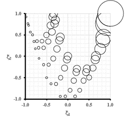 
      <em>(a)</em>
    </td>
    <td align="center" style="border:1px solid black; padding:6px;">
      
      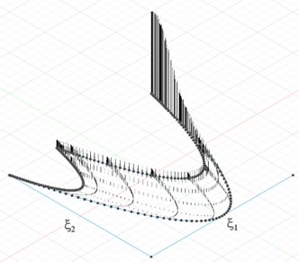 
      <em>(b)</em>
    </td>
  </tr>
    <tr>
    <td colspan="2" align="center" style="border:1px solid black; padding:6px;">
      
      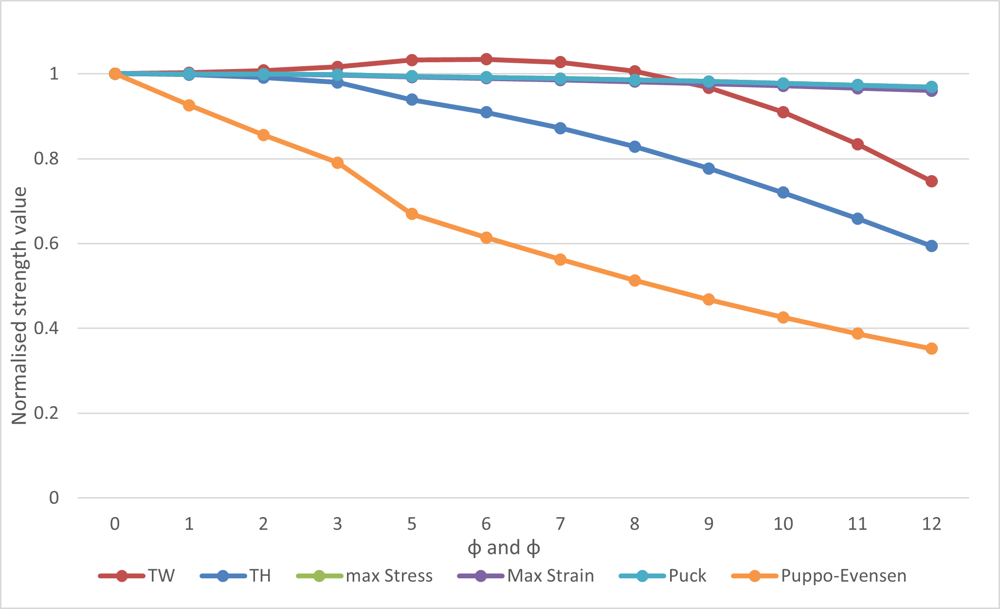 
      <em>(c)</em>
    </td>
  </tr>
</table>

<em><strong>Figure 1.</strong> Illustration of: (a) a bubble plot with comparison of a full size bubble at ($\xi_1$, $\xi_2$) = (1, 1); (b) a 3-D conversion of the bubble plot for laminate <strong><em>d</em></strong> and (c) comparisons between 6 failure criteria with $\psi$, and $\phi$ ranging from 0° to 12°.</em>

[Figures 2(a)](#figure:BubbleXi1-2_NormalAngle_a-d) and [(b)](#figure:BubbleXi1-2_SwitchedAngle_a-d) represent bubble plots of the first ply failure strength of DD laminates <strong><em>a</em></strong> to <strong><em>d</em></strong>, in 10° increments across the design space for both normal and switched angles, while [Figs. 2(c)](#figure:BubbleXi1-2_NormalAngle_e-f) and [2(d))](#figure:BubbleXi1-2_SwitchedAngle_e-f) represent the bubble plots for laminate <strong><em>e</em></strong> and <strong><em>f</em></strong>. The black bold  lines in the design spaces representing $k_x$ = 4.0 is superimposed on [Figs. 2(a)](#figure:BubbleXi1-2_NormalAngle_a-d) to [(d)](#figure:BubbleXi1-2_SwitchedAngle_e-f). [Figures 2(e)](#figure:PlyPercentageBubble-Normal) and [(f)](#figure:PlyPercentageBubble-Switched) show bubble plots of standard ply angles with the 10\% rule applied and onto which the 6 DD laminate designs are superimposed for comparisons. The Tsai-Wu failure criterion is used to assess uniaxial compression strength, which is proportional to bubble area and is normalized with respect to the 0° ply laminate,which has the highest failure strength of 1. Only the results for DD laminates <strong><em>a</em></strong> to <strong><em>d</em></strong> are given in [Figs. 2(a)](#figure:BubbleXi1-2_NormalAngle_a-d) and [(b))](#figure:BubbleXi1-2_SwitchedAngle_a-d). The location of typical aircraft wing skin designs is also plotted on the lamination design space of [Figs. w(b)](#figure:BubbleXi1-2_SwitchedAngle_a-d), [2(c)](#figure:BubbleXi1-2_NormalAngle_e-f), [(e)](#figure:PlyPercentageBubble-Normal) and [(f)](#figure:PlyPercentageBubble-Switched) for comparison with the DD laminates. The colour of the bubbles corresponds to the colours of the DD Designs <strong><em>a</em></strong>, <strong><em>b</em></strong>, <strong><em>c</em></strong>, <strong><em>d</em></strong>, <strong><em>e</em></strong> and <strong><em>f</em></strong>. 

<table style="border:1px solid black; border-collapse:collapse;">
  <tr>
    <td align="center" style="border:1px solid black; padding:6px;">
      
      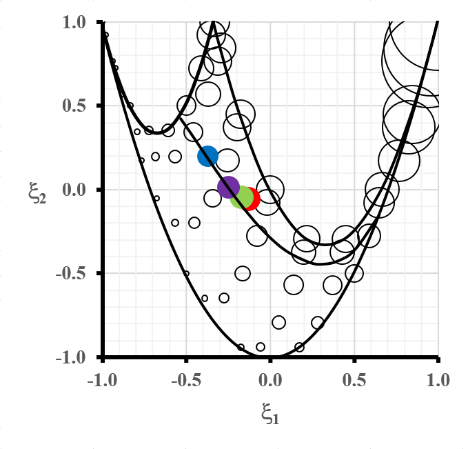 
      <em>(a)</em>
    </td>
    <td align="center" style="border:1px solid black; padding:6px;">
      
      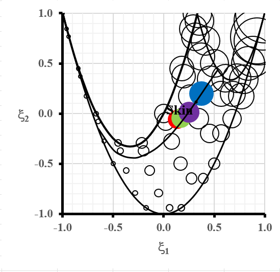 
      <em>(b)</em>
    </td>
  </tr>
  <tr>
    <td align="center" style="border:1px solid black; padding:6px;">
      
      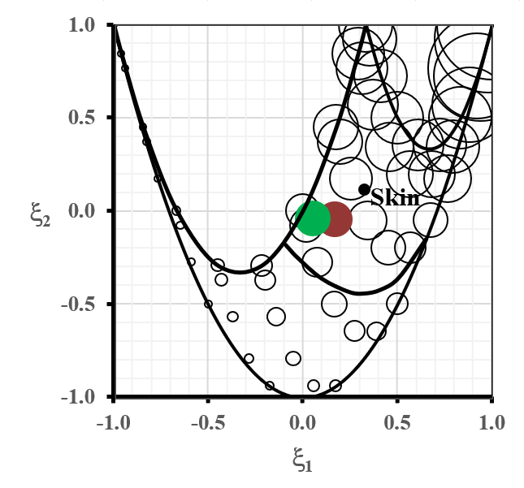 
      <em>(c)</em>
    </td>
    <td align="center" style="border:1px solid black; padding:6px;">
      
      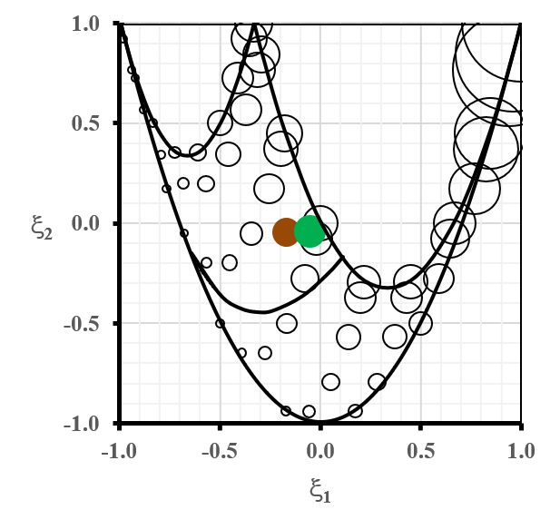 
      <em>(d)</em>
    </td>
  </tr>
    <tr>
    <td align="center" style="border:1px solid black; padding:6px;">
      
      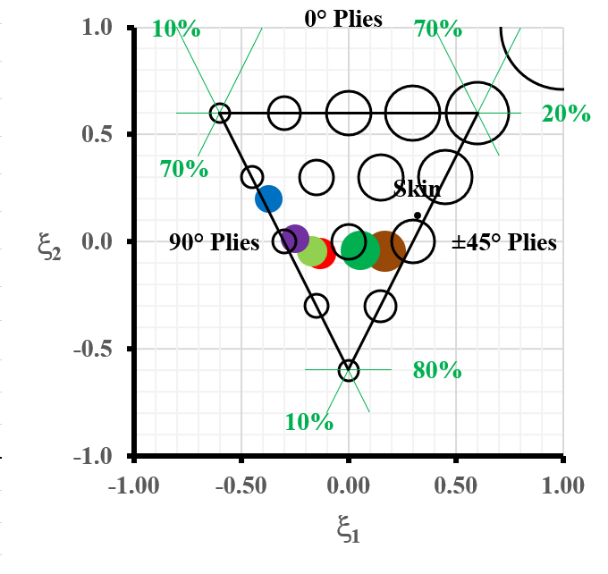 
      <em>(c)</em>
    </td>
    <td align="center" style="border:1px solid black; padding:6px;">
      
      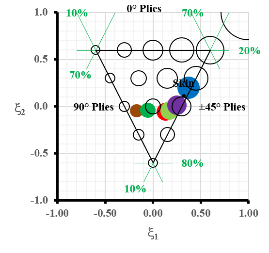 
      <em>(d)</em>
    </td>
  </tr>
</table>

<em><strong>Figure 2.</strong> Strength comparisons for fully uncoupled Standard laminates (satisfying 10\% rule) and DD laminates for stacking sequences <strong><em>a</em></strong> to <strong><em>d</em></strong> with angles: (a) as listed in Table \ref{Table:SSofa-f}; (b) switched; stacking sequences <strong><em>e</em></strong> and <strong><em>f</em></strong> with angles: (c) as listed in Table \ref{Table:SSofa-f}; (d) switched. Standard laminates are superimposed on designs <strong><em>a</em></strong> to <strong><em>f</em></strong> with angles: (e) listed in Table \ref{Table:SSofa-f} and; (f) switched.  Strength values are indicated by bubble area, normalized against maximum (100\%) strength for 0° ply laminate shown at ($\xi_1$, $\xi_2$) = (1, 1).</em>

[Figures 2(a)](#figure:BubbleXi1-2_NormalAngle_a-d) and [(b)](#figure:BubbleXi1-2_SwitchedAngle_a-d) illustrate the potential to optimize laminates for FPF strength without degrading the buckling load, by choosing designs along the buckling line indicated in bold in [Fig. 2 from Preject 4](#figure:LaminateD+Kx4).  This implies that the strength of composite laminates can be improved without a reduction in buckling load.  The equivalent line of constant buckling factor, $k_x$ = 4.0, is plotted in [Figs. 2(a)](#figure:BubbleXi1-2_NormalAngle_a-d) and [(b)](#figure:BubbleXi1-2_SwitchedAngle_a-d), revealing that the line on [Fig. 2(b)](#figure:BubbleXi1-2_SwitchedAngle_a-d) is very close to the typical location of aircraft wing skin configuration. From [Fig. 3(e)](#figure:BendingStiffnessDesignSpace-Normal-e), it can be seen that the designs <strong><em>e</em></strong> and <strong><em>f</em></strong>, with ($\xi_1$, $\xi_2$) = (0.17, -0.05) and (0.05, -0.04) respectively, have higher failure strength than designs <strong><em>a</em></strong> to <strong><em>d</em></strong>, but with angles switched using [Eqn. from Project 4]\ref{eq:AngleSwitched} in [Fig. 3(f)](#figure:BendingStiffnessDesignSpace-Normal-f), design <strong><em>d</em></strong> has the highest strength compared to the other designs.

Strength values are indicated by bubble area, normalized against maximum (100\%) strength for a 0° ply laminate shown at ($\xi_1$, $\xi_2$) = (1, 1). This was chosen to reflect the test procedure for determining laminate strength data. Laminate <strong><em>d</em></strong> has a normalised strength of 6.2\%, in [Figure 2(a)](#figure:BubbleXi1-2_NormalAngle_a-d), and with angles switched has a normalised strength of 10.3\%, in Figure [Fig. 2(b)](#figure:BubbleXi1-2_SwitchedAngle_a-d).  

Only 2 extensional stiffness design spaces are presented here for the 6 laminates, as laminates with the same ply percentages share the same extensional stiffness design space, i.e. <strong><em>a</em></strong> to <strong><em>d</em></strong> and <strong><em>e</em></strong> and <strong><em>f</em></strong>. In contrast, the bending stiffness design space is different for each design, which is shown in [Figs. 3](#figure:BendingStiffnessDesignSpace-Normal) and [4](#figure:BendingStiffnessDesignSpace-Switched), the former for normal angle and the latter for angle-switched designs.

<table style="border:1px solid black; border-collapse:collapse;">
  <tr>
    <td align="center" style="border:1px solid black; padding:6px;">
      
      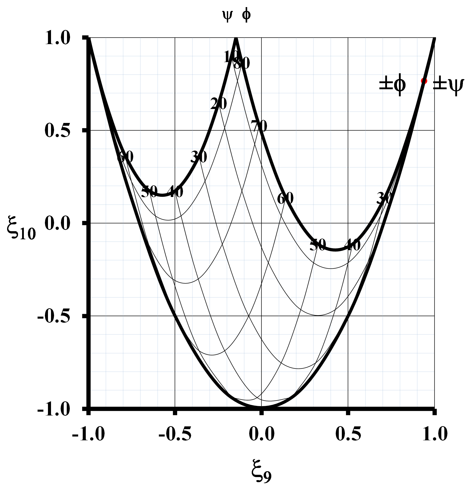 
      <em>(a)</em>
    </td>
    <td align="center" style="border:1px solid black; padding:6px;">
      
       
      <em>(b)</em>
    </td>
  </tr>
  <tr>
    <td align="center" style="border:1px solid black; padding:6px;">
      
      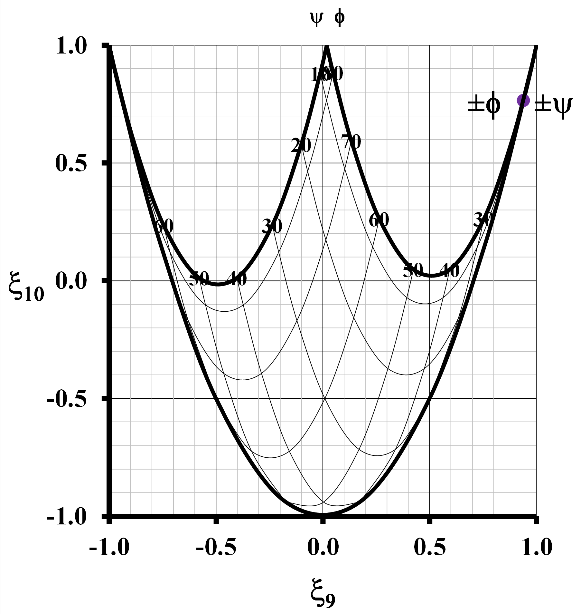 
      <em>(c)</em>
    </td>
    <td align="center" style="border:1px solid black; padding:6px;">
      
      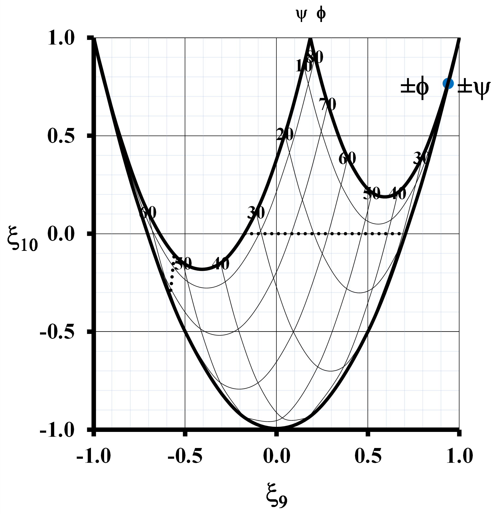 
      <em>(d)</em>
    </td>
  </tr>
    <tr>
    <td align="center" style="border:1px solid black; padding:6px;">
      
      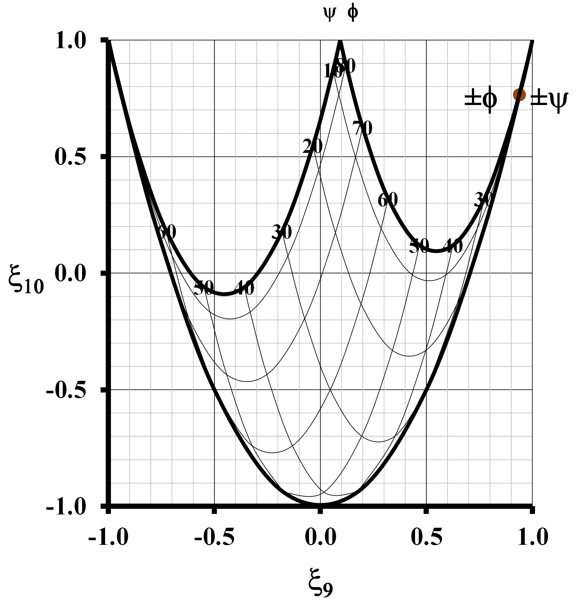 
      <em>(c)</em>
    </td>
    <td align="center" style="border:1px solid black; padding:6px;">
      
      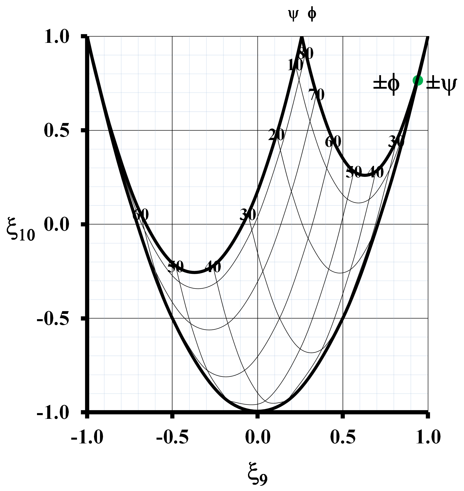 
      <em>(d)</em>
    </td>
  </tr>
</table>

<em><strong>Figure 3.</strong> The bending stiffness design space for the laminates with normal angle configurations (a): <strong><em>a</em></strong>; (b): <strong><em>b</em></strong>; (c): <strong><em>c</em></strong>; (d): <strong><em>d</em></strong>; (e): <strong><em>e</em></strong> and (f): <strong><em>f</em></strong>.</em>

<table style="border:1px solid black; border-collapse:collapse;">
  <tr>
    <td align="center" style="border:1px solid black; padding:6px;">
      
      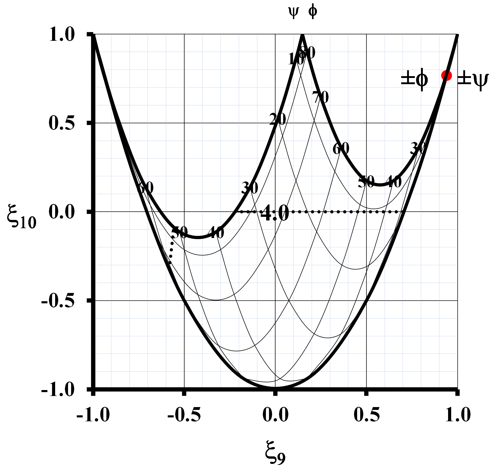 
      <em>(a)</em>
    </td>
    <td align="center" style="border:1px solid black; padding:6px;">
      
       
      <em>(b)</em>
    </td>
  </tr>
  <tr>
    <td align="center" style="border:1px solid black; padding:6px;">
      
       
      <em>(c)</em>
    </td>
    <td align="center" style="border:1px solid black; padding:6px;">
      
      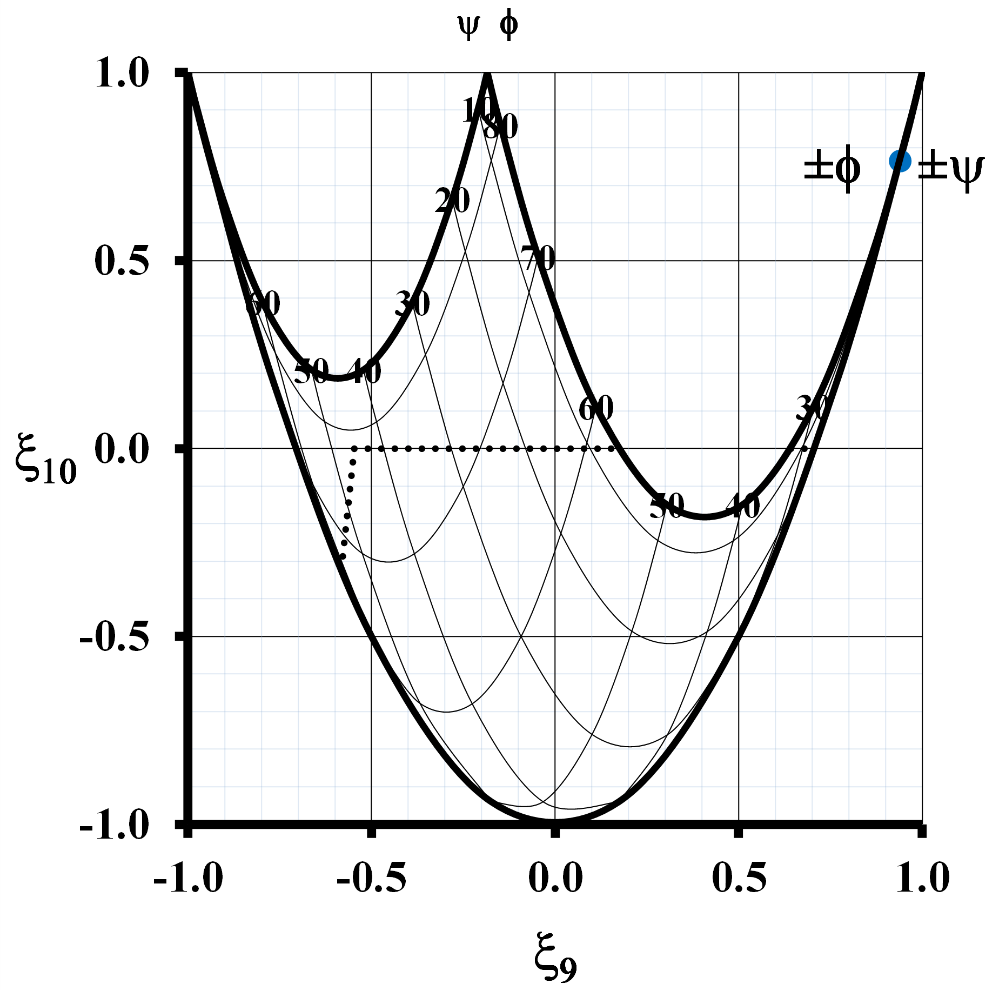 
      <em>(d)</em>
    </td>
  </tr>
    <tr>
    <td align="center" style="border:1px solid black; padding:6px;">
      
      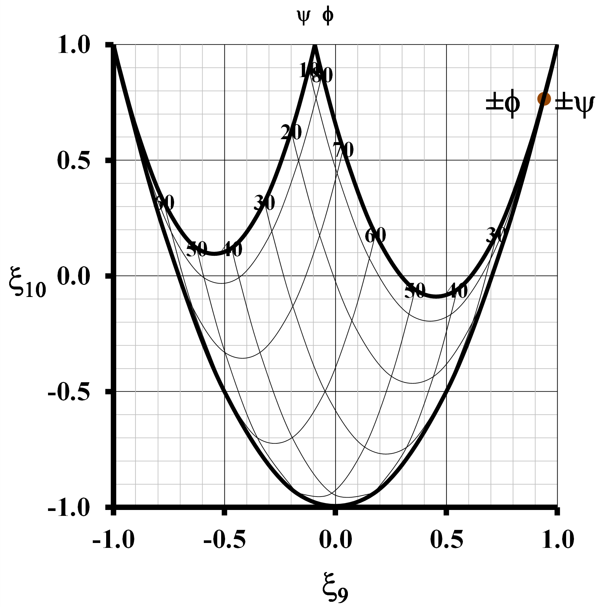 
      <em>(c)</em>
    </td>
    <td align="center" style="border:1px solid black; padding:6px;">
      
      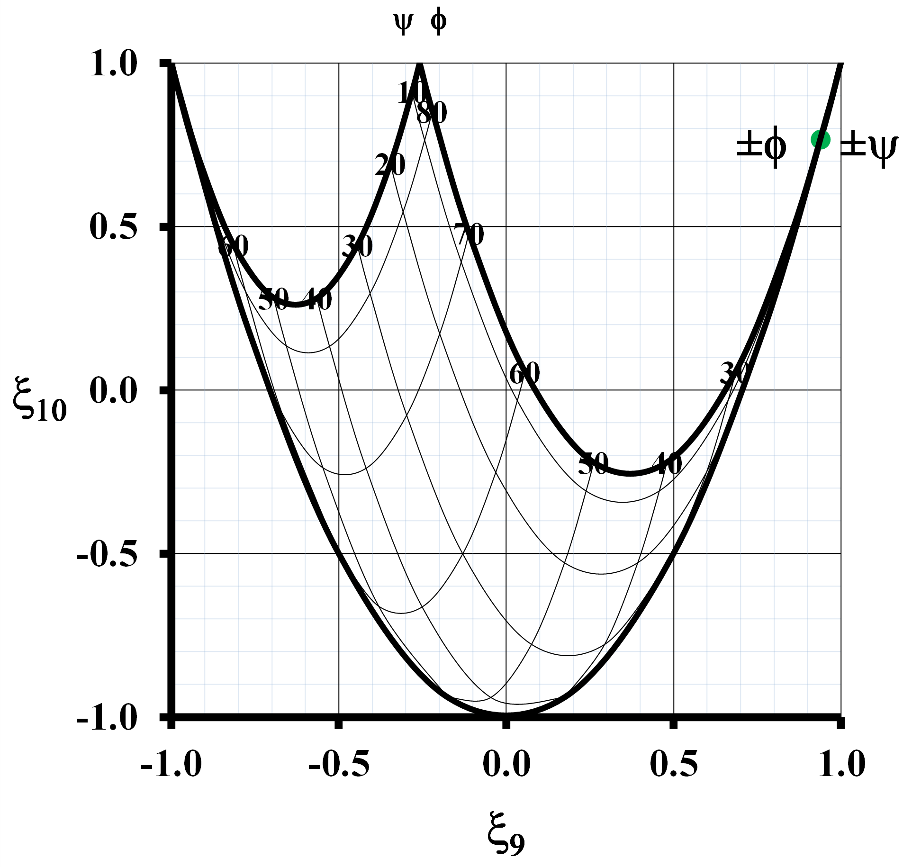 
      <em>(d)</em>
    </td>
  </tr>
</table>

<em><strong>Figure 4.</strong> The bending stiffness design space for the laminate with angle switched configurations (a): <strong><em>a</em></strong>; (b): <strong><em>b</em></strong>; (c): <strong><em>c</em></strong>; (d): <strong><em>d</em></strong>; (e): <strong><em>e</em></strong> and (f): <strong><em>f</em></strong>.</em>

