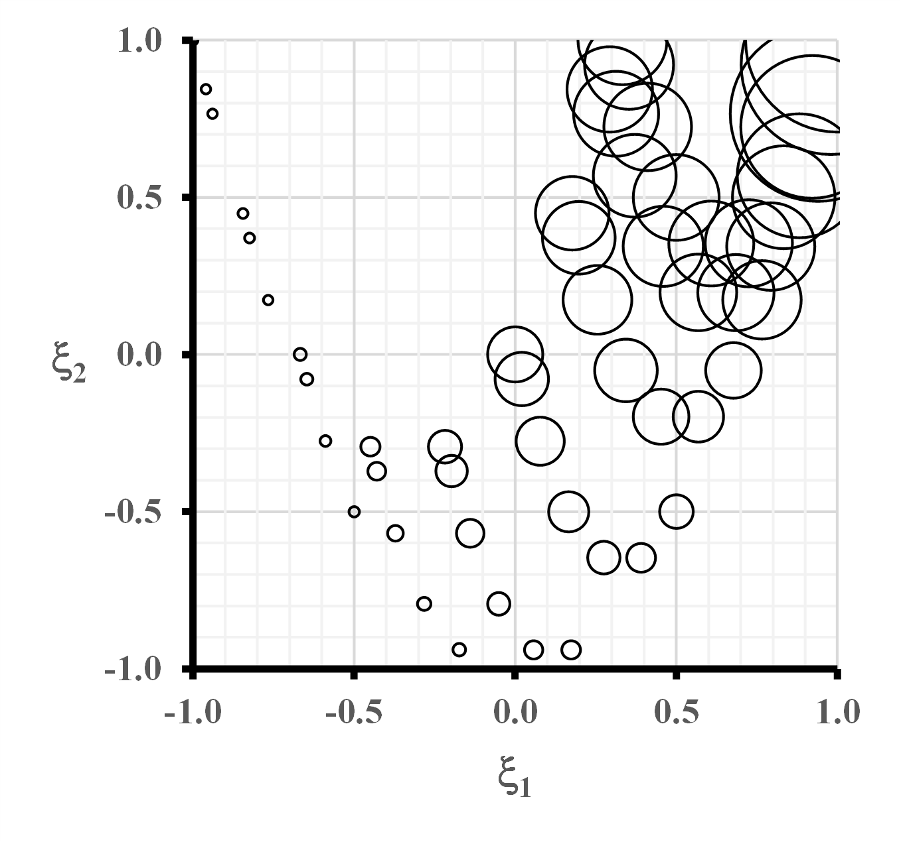
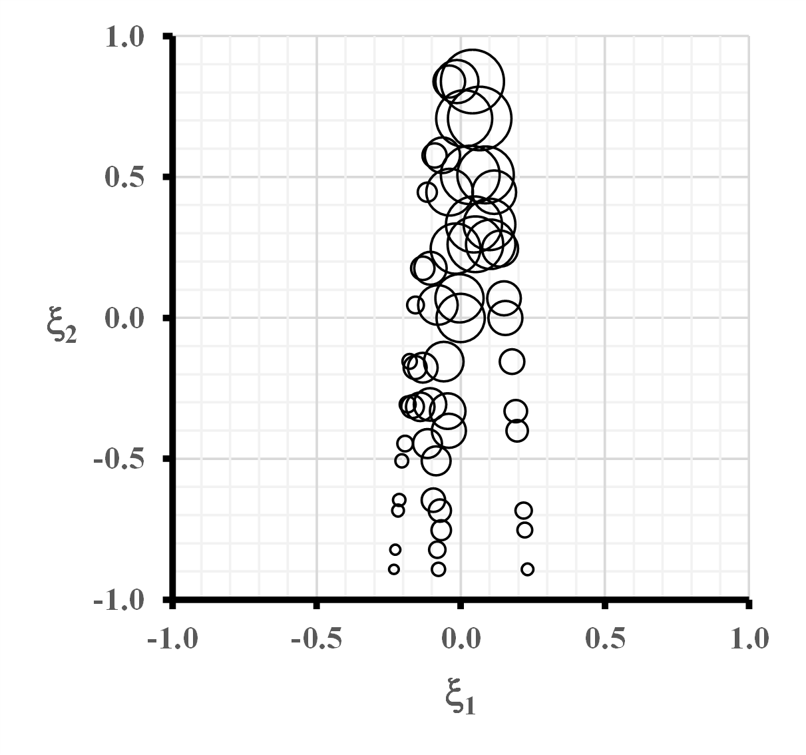
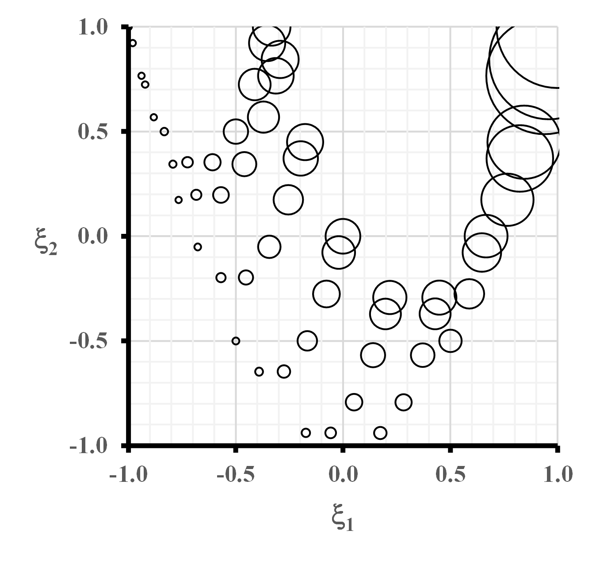
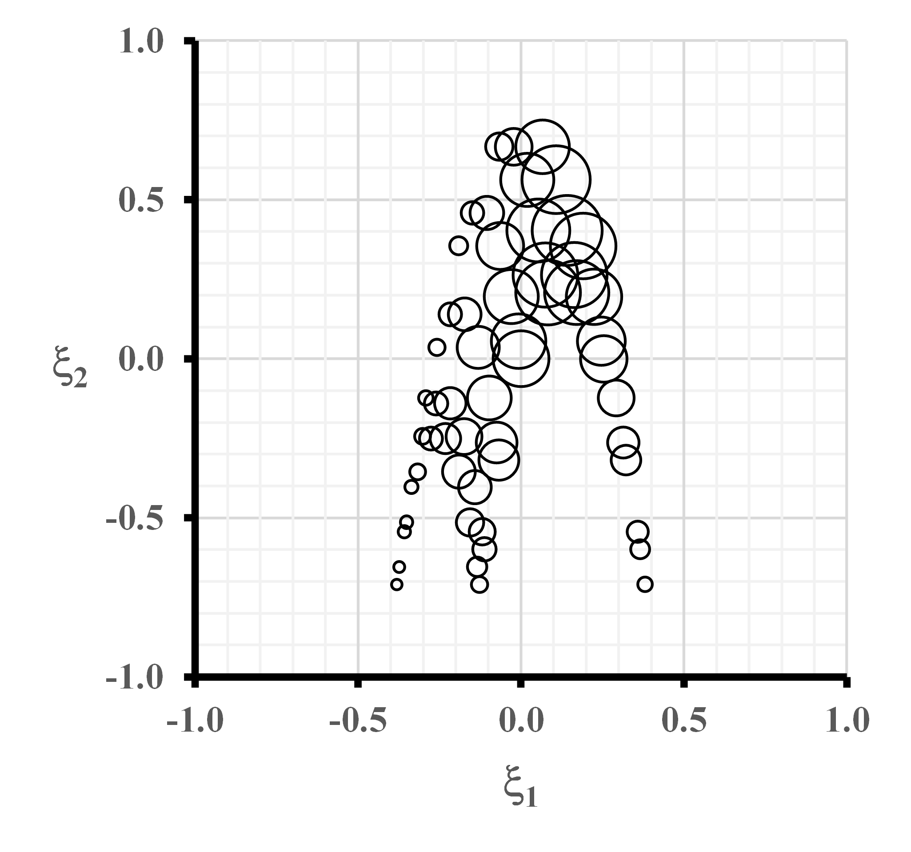
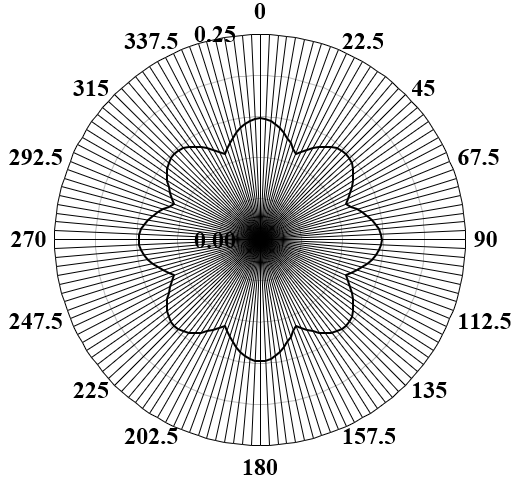
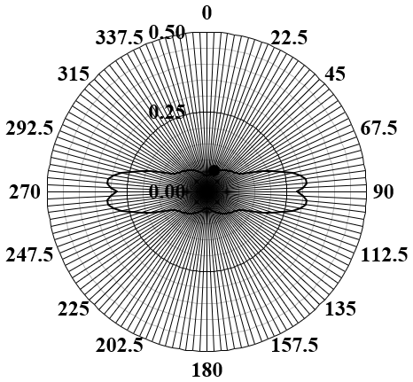
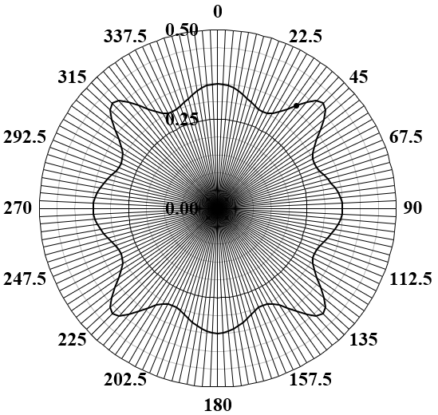
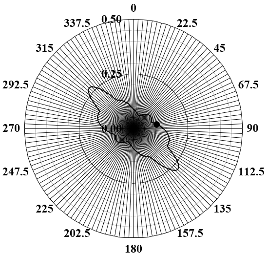
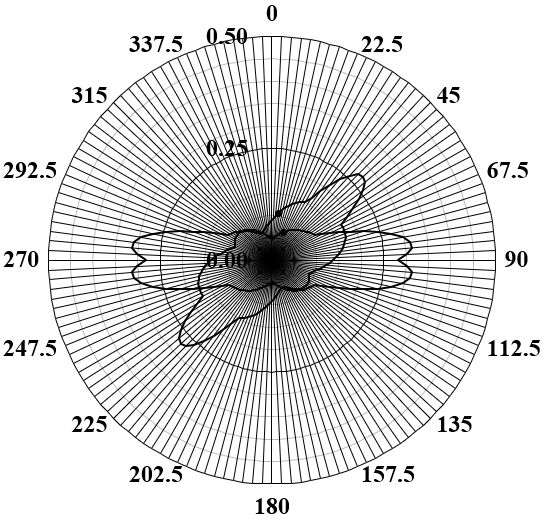

# Project 06 — Off-axis alignment
The project aim to explore the effect of off-axis alignmennt on first ply failure (FPF) performance of composite laminates with double-angle configurations.

## Introducton

Off-axis alignments from 0° to 360° are introduced to the laminate designs listed above, and the resulting first ply failure performance, predicted using the Tsai-Wu failure criterion, is presented using polar plots. Fig. \ref{figure:PolarPlots} represents polar plots of first ply failure with applied off-axis orientation, including the 6 DD laminates, balanced and symmetric, isotropic and Extension-Shear coupled only laminates. All the designs are normalized against DD laminate <strong><em>d</em></strong> which has the lowest first ply failure load. The point on each figure, denoted by the value of $\beta$, gives the maximum value of $A_{16}$/$A_{11}$.

<table style="border:1px solid black; border-collapse:collapse;">
  <tr>
    <td align="center" style="border:1px solid black; padding:6px;">
      
       
      <em>(a) Max $A_{16}/A_{11}=8.3\%$ at $\beta=32.5°$</em>
    </td>
    <td align="center" style="border:1px solid black; padding:6px;">
      
       
      <em>(b) Max $A_{16}/A_{11}=8.3\%$ at $\beta=32.5°$</em>
    </td>
  </tr>
  <tr>
    <td align="center" style="border:1px solid black; padding:6px;">
      
       
      <em>(c) Max $A_{16}/A_{11}=-10.4\%$ at $\beta=33.8°$</em>
    </td>
    <td align="center" style="border:1px solid black; padding:6px;">
      
       
      <em>(d) Max $A_{16}/A_{11}=-14.4\%$ at $\beta=38.3°$</em>
    </td>
  </tr>
    <tr>
    <td align="center" style="border:1px solid black; padding:6px;">
      
       
      <em>(e) Max $A_{16}/A_{11}=-22.1\%$ at $\beta=46.1°$</em>
    </td>
    <td align="center" style="border:1px solid black; padding:6px;">
      
       
      <em>(f) Max $A_{16}/A_{11}=10.3\%$ at $\beta=56.2°$</em>
    </td>
  </tr>
  <tr>
    <td align="center" style="border:1px solid black; padding:6px;">
      
       
      <em>(g) Max $A_{16}/A_{11}=3.6\%$ at $\beta=59.1°$</em>
    </td>
    <td align="center" style="border:1px solid black; padding:6px;">
      
       
      <em>(h) Laminates <strong><em>a</em></strong> to <strong><em>f</em></strong> out envelopes</em>
    </td>
  </tr>
  <tr>
    <td align="center" style="border:1px solid black; padding:6px;">
      
       
      <em>(i) $A_{16}/A_{11}=16.3\%$ at $\beta=0°$ and Max $A_{16}/A_{11}=18.0\%$ at $\beta=170.1°$</em>
    </td>
    <td align="center" style="border:1px solid black; padding:6px;">
      
       
      <em>(j) Laminate <strong><em>d</em></strong> and <em>E-S</em> coupled outer envelopes}</em>
    </td>
  </tr>
  <tr>
    <td align="center" style="border:1px solid black; padding:6px;">
      
       
      <em>(k) Superimposed laminate <strong><em>d</em></strong> and <em>E-S</em> coupled design</em>
    </td>
  </tr>
</table>

<em><strong>Figure 1.</strong> Strength comparisons for off-axis orientation $\beta$ between a full envelope of 24 plies: (a) Isotropic laminate; DD laminate design: (b) <strong><em>a</em></strong>; (c) <strong><em>b</em></strong>; (d) <strong><em>c</em></strong>; (e) <strong><em>d</em></strong>; (f) <strong><em>e</em></strong> and (g) <strong><em>f</em></strong>; (h) superimposed laminates <strong><em>a</em></strong> to <strong><em>f</em></strong>; (i) Balanced and symmetric; (j) <em>E-S</em> coupled (only) design and; (k) Superimposed laminate <strong><em>d</em></strong> and <em>E-S</em> coupled design, all subject to equal compressive force resultant ($N_x$).</em>

Laminate <strong><em>d</em></strong> has the highest maximum $A_{16}$/$A_{11}$ among all the DD designs. The angles switched laminates gives the same maximum $A_{16}$/$A_{11}$ as their non-switched angles counter laminates. Normalised against the first ply failure load for laminate <strong><em>d</em></strong> (100\% at $\beta$ = ±7.1°), the balanced and symmetric design is at 37.5\% of its material strength constraint and the <em>Extension-Shear</em> coupled only laminate is at 79.3\% (at $\beta$ = 0°).  However, at off-axis alignment, corresponding to maximum $A_{16}$/$A_{11}$, laminate <strong><em>d</em></strong> and the balanced and symmetric designs are at 68.9\% (at $\beta$ = 46.1°) and 73.1\% (at $\beta$ = 37.3°) of their material strength constraint, respectively. This shows that the FPF of the laminate designs can be improved by implementing off-axis alignments.

[Figure 2](#figure:DesignSpacewithBeta-Normal) shows the design spaces of the 6 DD laminates. The initial graphs in this figure are plotted with the off-axis alignment of each laminate orientated to give the max value of $A_{16}/A_{11}$ applied (as indicated in the top row of the Figure) the subsequent graphs in [Fig. 2](#figure:DesignSpacewithBeta-Normal)  are without off-axis alignment. [Figure 3](#figure:DesignSpacewithBeta-Switched) presents the similar design spaces for the angle switched version. $\phi$ and $\psi$ are swept from 0° \xspace to 90° \xspace to investigate the effect of off-axis alignment on both the design space and the material strength. The design space shrinks as $\beta$ increases from 0° to 45° and expands from 45° to 90°.

<table style="border:1px solid black; border-collapse:collapse;">
  <!-- Top row: single centered figure -->
  <tr>
    <td colspan="4" align="center" style="border:1px solid black; padding:6px;">
      
       
      <em>(a) Laminate <strong><em>a</em></strong> - <strong><em>d</em></strong> without off-axis alignment $\beta$</em>
    </td>
  </tr>

  <!-- Bottom row: four figures -->
  <tr>
    <td align="center" style="border:1px solid black; padding:6px;">
      
       
      <em>(b) Laminate <strong><em>a</em></strong> (Max $A_{16}/A_{11}=8.3\%$ at $\beta=32.5°$)</em>
    </td>
    <td align="center" style="border:1px solid black; padding:6px;">
      
       
      <em>(c) Laminate <strong><em>b</em></strong> (Max $A_{16}/A_{11}=10.4\%$ at $\beta=33.8°$)</em>
    </td>
    <td align="center" style="border:1px solid black; padding:6px;">
      
       
      <em>(d) Laminate <strong><em>c</em></strong> (Max $A_{16}/A_{11}=14.4\%$ at $\beta=38.3°$)</em>
    </td>
    <td align="center" style="border:1px solid black; padding:6px;">
      
       
      <em>(e) Laminate <strong><em>d</em></strong> (Max $A_{16}/A_{11}=22.1\%$ at $\beta=46.1°$)</em>
    </td>
  </tr>

  <tr>
    <td colspan="4" align="center" style="border:1px solid black; padding:6px;">
      
       
      <em>(f) Laminate <strong><em>e</em></strong> - <strong><em>f</em></strong> without off-axis alignment $\beta$</em>
    </td>
  </tr>

  <tr>
    <td colspan="4" align="center" style="border:1px solid black; padding:10px;">
      
       
      <em>(f)</em>
    </td>
  </tr>

  <tr>
    <td align="center" style="border:1px solid black; padding:10px;">
      
       
      <em>(g)</em>
    </td>
</table>

<em><strong>Figure 2.</strong> Illustration of the extensional stiffness design spaces of the 6 DD laminate designs with and without off-axis alignment, and bubbles indicating the normalized FPF strength
</em>

<table style="border:1px solid black; border-collapse:collapse;">
  <!-- Top row: single centered figure -->
  <tr>
    <td colspan="4" align="center" style="border:1px solid black; padding:6px;">
      
       
      <em>(a) Laminate <strong><em>a</em></strong> - <strong><em>d</em></strong> without off-axis alignment $\beta$</em>
    </td>
  </tr>

  <!-- Bottom row: four figures -->
  <tr>
    <td align="center" style="border:1px solid black; padding:6px;">
      
       
      <em>(b) Laminate <strong><em>a</em></strong> (Max $A_{16}/A_{11}=8.3\%$ at $\beta=32.5°$)</em>
    </td>
    <td align="center" style="border:1px solid black; padding:6px;">
      
       
      <em>(c) Laminate <strong><em>b</em></strong> (Max $A_{16}/A_{11}=10.4\%$ at $\beta=33.8°$)</em>
    </td>
    <td align="center" style="border:1px solid black; padding:6px;">
      
       
      <em>(d) Laminate <strong><em>c</em></strong> (Max $A_{16}/A_{11}=14.4\%$ at $\beta=38.3°$)</em>
    </td>
    <td align="center" style="border:1px solid black; padding:6px;">
      
       
      <em>(e) Laminate <strong><em>d</em></strong> (Max $A_{16}/A_{11}=22.1\%$ at $\beta=46.1°$)</em>
    </td>
  </tr>

  <tr>
    <td colspan="4" align="center" style="border:1px solid black; padding:6px;">
      
       
      <em>(f) Laminate <strong><em>e</em></strong> - <strong><em>f</em></strong> without off-axis alignment $\beta$</em>
    </td>
  </tr>

  <tr>
    <td colspan="4" align="center" style="border:1px solid black; padding:10px;">
      
       
      <em>(f)</em>
    </td>
  </tr>

  <tr>
    <td align="center" style="border:1px solid black; padding:10px;">
      
       
      <em>(g)</em>
    </td>
</table>

<em><strong>Figure 3.</strong> Illustration of the extension stiffness design spaces of the 6 angle switched DD laminate designs with and without off-axis alignment, and bubbles indicating the normalized FPF strength</em>

Figure \ref{figure:PolarPlotVs0-Normal} shows a series of polar plots showing the normalised first ply failure load,  using the FPF load of a 24-ply unidirectional laminate containing all 0° laminate with FPF strength of 5027N. In mathematical representation, is given as $N_x$/$N_{X_{0°}}$.

<table style="border:1px solid black; border-collapse:collapse;">
  <tr>
    <td align="center" style="border:1px solid black; padding:6px;">
      
       
      <em>(a)</em>
    </td>
    <td align="center" style="border:1px solid black; padding:6px;">
      
       
      <em>(b)</em>
    </td>
  </tr>
  <tr>
    <td align="center" style="border:1px solid black; padding:6px;">
      
       
      <em>(c)</em>
    </td>
    <td align="center" style="border:1px solid black; padding:6px;">
      
       
      <em>(d)</em>
    </td>
  </tr>
    <tr>
    <td align="center" style="border:1px solid black; padding:6px;">
      
       
      <em>(c)</em>
    </td>
  </tr>
</table>

<em><strong>Figure 4.</strong> Strength comparisons for off-axis orientation $\beta$ between a full envelope of 24 ply: (a) Isotropic laminate; (b) DD laminate design <strong><em>d</em></strong>; (c) Balanced and symmetric; (d) \textit{E-S} coupled (only) design and; (e) Superimposed laminate <strong><em>d</em></strong> and \textit{E-S} coupled design, normalised to equal compressive force resultant ($N_x$) of 5027N.</em>

The FPF load ($N_x$) of a 0° laminate (5027N) is applied to all the designs as the input compressive load, and off-axis alignment is then introduced to calculate the Tsai-Wu FPF strength using Eqn. \ref{eq:TW}. As the FPF load for 0° off-axis alignment is the highest, all the Tsai-Wu values of the designs with off-axis alignment must be larger than 1.0. Therefore, the reciprocal values are used to generate the polar plots, meaning that 1.0 is the highest strength. 

Normalising against the first ply failure load for a 0° ply laminate, the Isotropic laminate has 8.5\% of the FPF strength and the <em>E-S</em> coupled only laminate has 5.5\% (at $\beta$ = 0°).  For off-axis alignment, corresponding to maximum $A_{16}/A_{11}$, laminate <strong><em>d</em></strong> and the balanced and symmetric designs are at 6.2\% (at $\beta$ = 46.1°) and 5.8\% (at $\beta$ = 37.3°) of the first ply failure strength, respectively.

However, off-axis alignment introduces extra terms in both extensional and bending stiffness lamination parameters i.e. $\xi_{3,4}$ and $\xi_{11,12}$, changing the design space from 2-D to 4-D. The relationship between the lamination parameters and off-axis alignment for the DD designs is presented in [Fig. 5](#figure:XivsBeta). Note that for $\xi_{1-4}$ and $\xi_{9-12}$ with the same relationship against $\beta$ (laminate <strong><em>a</em></strong>, <strong><em>b</em></strong>, <strong><em>c</em></strong> and <strong><em>d</em></strong>), the laminate is considered as Quasi Homogenous, where $D_{ij}=A_{ij}H^2/12$.

<table style="border:1px solid black; border-collapse:collapse;">
  <tr>
    <td align="center" style="border:1px solid black; padding:6px;">
      
       
      <em>(a)</em>
    </td>
    <td align="center" style="border:1px solid black; padding:6px;">
      
       
      <em>(b)</em>
    </td>
  </tr>
  <tr>
    <td align="center" style="border:1px solid black; padding:6px;">
      
       
      <em>(c)</em>
    </td>
    <td align="center" style="border:1px solid black; padding:6px;">
      
       
      <em>(d)</em>
    </td>
  </tr>
    <tr>
    <td align="center" style="border:1px solid black; padding:6px;">
      
       
      <em>(c)</em>
    </td>
    <td align="center" style="border:1px solid black; padding:6px;">
      
       
      <em>(d)</em>
    </td>
  </tr>
    <tr>
    <td align="center" style="border:1px solid black; padding:6px;">
      
       
      <em>(a)</em>
    </td>
    <td align="center" style="border:1px solid black; padding:6px;">
      
       
      <em>(b)</em>
    </td>
  </tr>
  <tr>
    <td align="center" style="border:1px solid black; padding:6px;">
      
       
      <em>(c)</em>
    </td>
    <td align="center" style="border:1px solid black; padding:6px;">
      
       
      <em>(d)</em>
    </td>
  </tr>
    <tr>
    <td align="center" style="border:1px solid black; padding:6px;">
      
       
      <em>(c)</em>
    </td>
    <td align="center" style="border:1px solid black; padding:6px;">
      
       
      <em>(d)</em>
    </td>
  </tr>
</table>

<em><strong>Figure 5.</strong> The relationship between the extensional $\xi_{1-4}$ and bending stiffness lamination parameters $\xi_{9-12}$ and $\beta$ for DD laminate designs: (a) <strong><em>a</em></strong>; (b) <strong><em>b</em></strong>; (c) <strong><em>c</em></strong>; (d) <strong><em>d</em></strong>; (e) <strong><em>e</em></strong> and (f) <strong><em>f</em></strong>.</em>

[Figure 5](#figure:XivsBeta) demonstrated that the values of $\xi_{1-4}$ can increase up to almost ±0.4, while the values of $\xi_{9-12}$ ranged between ±0.0006. However, the the relationship between the lamination parameters and off-axis alignment and the influence are generally not understood, more thorough explanation is required. Therefore, Chapter \ref{Chapter:Coupling} will focus on the influence of the coupling terms and 4-D design spaces.

Table \ref{Table:Platewidth} presents the required laminate width, $b$, for coincident buckling and first ply failure under compression load of the DD laminate designs for aspect ratios $a/b$ = 1.0, 1.5, 2.0 and 2.5. The dimensions are typical of the width between stiffeners in a stiffened panel wing skin. Table \ref{Table:PlateThickness} shows the width-to-total thickness ratio, $b/H$, of the optimal designs in Table \ref{Table:Platewidth}. Note that results of a/b = 1 and 2 are shown in the same row as the two ratios share identical dimensions.

| AR | <strong><em>a</em></strong> | <strong><em>b</em></strong> | <strong><em>c</em></strong> | <strong><em>d</em></strong> | <strong><em>e</em></strong> | <strong><em>f</em></strong> |
|:--:|:--:|:--:|:--:|:--:|:--:|:--:|
| 1 and 2 | 107.7 | 107.7 | 116.5 | 124.5 | 92.0 | 98.6 |
| 1.5     | 112.1 | 115.3 | 121.4 | 129.6 | 95.8 | 102.7 |
| 2.5     | 109.4 | 112.6 | 118.5 | 126.5 | 93.5 | 100.2 |

<em><strong>Table 1.</strong> Plate width (mm), $b$, corresponding to 24-ply DD design with coincident buckling and first ply failure.</em>

| AR | <strong><em>a</em></strong> | <strong><em>b</em></strong> | <strong><em>c</em></strong> | <strong><em>d</em></strong> | <strong><em>e</em></strong> | <strong><em>f</em></strong> |
|:--:|:--:|:--:|:--:|:--:|:--:|:--:|
| 1 and 2 | 32.1 | 33.0 | 34.8 | 37.1 | 27.4 | 29.4 |
| 1.5     | 33.4 | 34.4 | 36.2 | 38.7 | 28.6 | 30.6 |
| 2.5     | 32.6 | 33.6 | 35.3 | 37.7 | 27.9 | 29.9 |

<em><strong>Table 4.</strong> Width-to-thickness ratio, $b/H$, corresponding to optimal 24 ply DD designs in [Table 1](#Table:Platewidth).</em>

