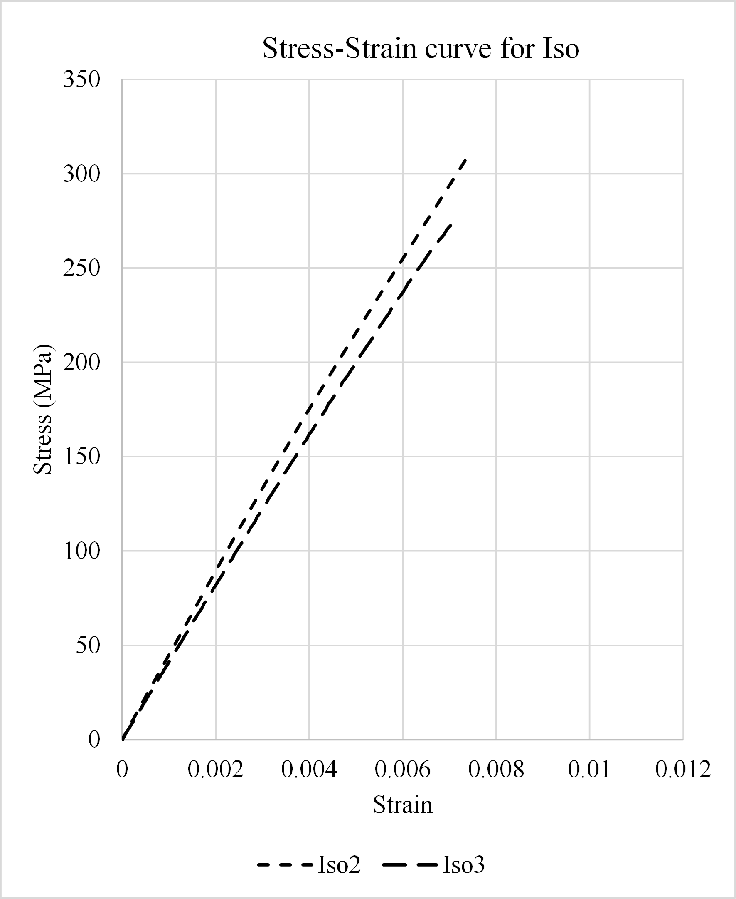
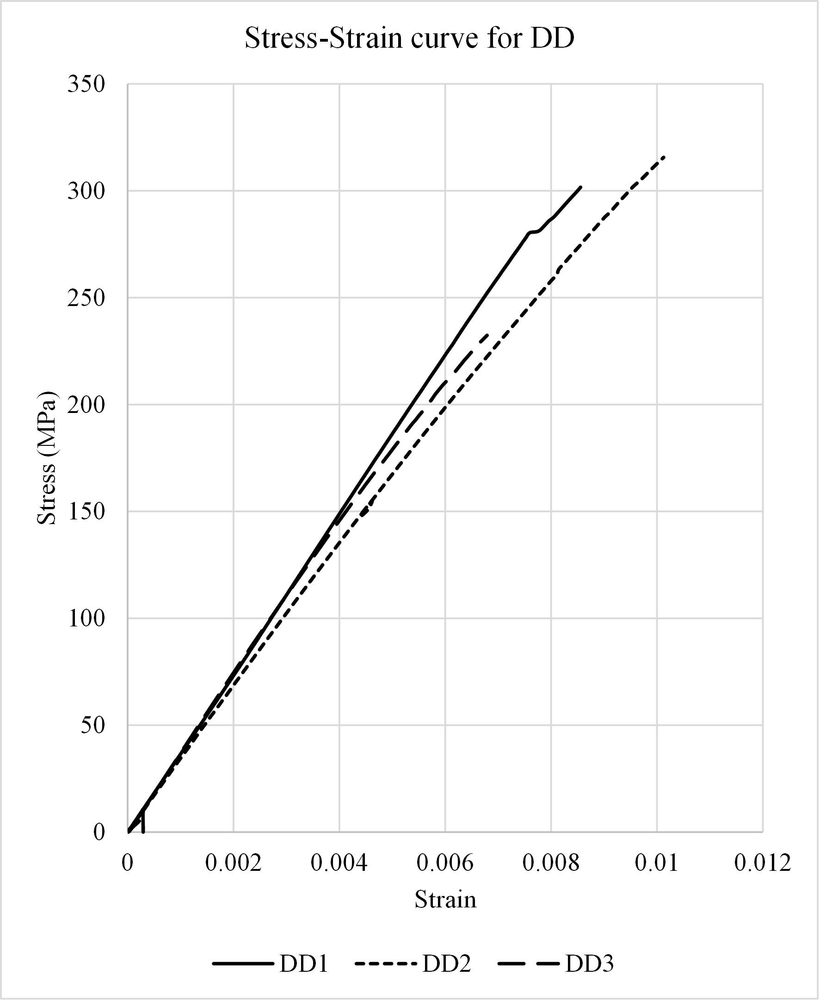
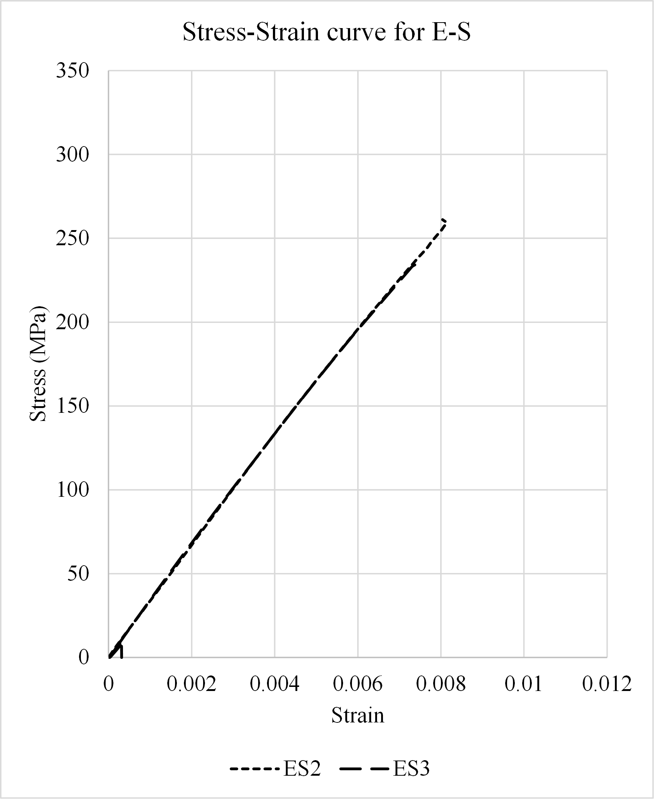
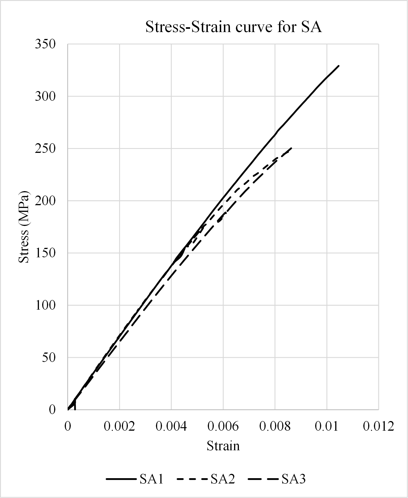

# Project 06 — Off-axis alignment
The project aim to explore the effect of off-axis alignmennt on first ply failure (FPF) performance of composite laminates with double-angle configurations.

## Introducton

The final section of this chapter involves compression tests. The main objective of the tests is to characterise the compression behaviour of the material including compression stiffness, evaluate predictions made in this chapter and investigate the failure strength of the laminate designs discussed in this chapter. Due to COVID-19, I was not able to perform the manufacture and test process myself, but Prof. Christopher York and Dr Periyasamy Manikandan kindly helped carry out the processes at the Singapore Institution of Technology. Double angle-ply laminate design, \textcolor{blue}{\textbf{\textit{d}}} with $\beta$ = -46.1\textdegree, isotropic, <em>E-S</em> coupled and balanced and symmetric (BS) laminates with $\beta$ = 37.3\textdegree were manufactured, with 3 specimens tested for each design. The stacking sequences are listed in Chapter \ref{sec:4.2}. SE 84LV low temperature cure carbon fibre epoxy prepreg was used [14], the designed length, width and thickness of the laminates were: 150 mm, 25 mm and 3.30 mm, and a cross sectional area, $A$, of 82.5 mm\textsuperscript{2}. 

The unidirectional (UD) prepreg tape was rolled out and cut manually to the required fibre orientations and the plies were manually stacked according to the specified stacking sequences. To remove any voids or air gaps between plies during the lay-up process, debulking was performed in every 6 plies of stacking. Stacked laminates were then cured using an autoclave programmed to the recommendations given by the material supplier, where pressure and temperature are 1 bar and 80 \textcelsius.

The laminates are then cut into the desired size as shown in Fig. \ref{figure:Samples-cutting}.

 

<em><strong>Figure 1.</strong> Cutting DD laminates</em>

[Figure 1](#figure:Samples-DD) shows a demonstration of the manufactured DD laminates.

 

<em><strong>Figure 2.</strong> Manufactured DD laminates</em>

All the specimens were held using a fully clamped end boundary condition for the tests. The compression test was carried out using the Z100 Universal Test machine at a displacement rate of 1 mm/min (meaning the crosshead of the UTM is allowed to move by 1 mm per minute). The fixture used was identical to the one described in the ASTM standard \cite{ASTM-D3410}. 

The compression test was conducted as follows:
	-  The manufactured specimen was placed and aligned at the centre of the wedges using an alignment bar.
	-  The specimen with wedges was placed into the wedge housing block assemblies.
	-  The housing assemblies were attached to the platens, with the upper wedge housing block assembly attached to the upper crosshead of the test machine and the lower housing block assembly fitted on a lower platen.
	-  To ensure that no small clearance or gap was present between the planar surface of the wedges and the housing block, an initial preload was applied to the specimen before recording the actual test data, in this case, the preload was 1 kN.
	-  The coupon was loaded to 1 kN and returned to 0 to monitor the strain readings, where the strains were usually about 100 to 200 micro-strain, which is negligible. 
	-  The compression test was started, and the samples were loaded until failure.

The measured values of the manufactured laminates are shown in Table \ref{Table:ExpSpecimenDimensions}, where DD, ES, BS and ISO represent the double angle-ply, \textit{Extension-Shear coupled}, balance and symmetric and fully isotropic designs. 

| Specimen | <em>l</em> (mm) | <em>w</em> (mm) | <em>t</em> (mm) | <em>A</em> (mm2) |
|:--------:|:--------------:|:--------------:|:--------------:|:--------------------------:|
| DD-1 | 150 | 24.72 | 3.29 | 81.31 |
| DD-2 | 150 | 24.00 | 3.40 | 81.60 |
| DD-3 | 150 | 24.97 | 3.41 | 85.02 |
| **—** | **—** | **—** | **—** | **—** |
| ES-1 | 150 | 23.95 | 3.39 | 81.19 |
| ES-2 | 150 | 24.04 | 3.38 | 81.24 |
| ES-3 | 150 | 24.57 | 3.38 | 83.05 |
| **—** | **—** | **—** | **—** | **—** |
| BS-1 | 150 | 23.94 | 3.39 | 81.14 |
| BS-2 | 150 | 24.17 | 3.39 | 81.94 |
| BS-3 | 150 | 24.42 | 3.41 | 85.27 |
| **—** | **—** | **—** | **—** | **—** |
| ISO-1 | 150 | 24.64 | 3.27 | 80.48 |
| ISO-2 | 150 | 23.99 | 3.38 | 81.07 |
| ISO-3 | 150 | 24.02 | 3.35 | 80.45 |

<em><strong>Table 2.</strong> Measured dimensions of manufactured laminate designs.</em>

Examples of the laminates after failure are shown in Fig. \ref{figure:failedSample}.

<table style="border:1px solid black; border-collapse:collapse;">
  <tr>
    <td align="center" style="border:1px solid black; padding:8px;">
      
       
      <em>(a)</em>
    </td>
  </tr>
  <tr>
    <td align="center" style="border:1px solid black; padding:8px;">
      
       
      <em>(b)</em>
    </td>
  </tr>
</table>

<em><strong>Figure 3.</strong>
Samples after failure for (a) all <em>E-S</em> laminates and (b) a zoomed in capture of one of the laminates after failure.
</em>

The resulting compressive stress is given as:

$$
	\sigma_i = \frac{P_i}{A}
    \tag{Eqn. 1}			
$$

where Pi represents the compressive load at a particular point. 

Finally, the chord modulus of elasticity, E\textsubscript{chord}, is given as:

$$
	E = \frac{\delta\sigma}{\delta\epsilon}			
    \tag{Eqn. 2}			
$$

A range of strain from 1000 to 3000 $\mu$ strain  is used for modulus calculations, which is recommended by ASTM standards \cite{ASTM-D3410}. Strain gauges were attached to the front and back surfaces of the test specimens, one on each surface. A compression load was applied until the specimens failed. The resulting failure strength, maximum stress, strain and modulus obtained using both the measured dimension and design dimensions are summarised in [Tables 1](#Table:ExpCal-Measured) and [2](#1Table:ExpCal-Designed). The resulting stress-strain graphs of the specimens are presented in [Fig. 4](#figure:StressStrainExp). 
While FPF predictions are made using Tsai-Wu failure criteria for comparisons, which are given in [Table 3](#Table:FPFPredictionForComText), since the engineering properties of the SE 84LV material is not given by the material supplier, T300/5208 is used for the prediction and the predictions are used to compare to the test results.

<table>
  <caption style="caption-side: top; text-align: left;">
    <em><strong>Table 1.</strong> Resulted failure strength, maximum stress, strain and modulus obtained from using measured dimensions.</em>
  </caption>

  <!-- ===== Block 1: Pmax and sigma_max ===== -->
  <thead>
    <tr>
      <th rowspan="2" style="text-align:center;">Sample</th>
      <th colspan="4" style="text-align:center;">Pmax (kN)</th>
      <th colspan="4" style="text-align:center;">σmax (MPa)</th>
    </tr>
    <tr>
      <th style="text-align:center;">ISO</th>
      <th style="text-align:center;">DD</th>
      <th style="text-align:center;">ES</th>
      <th style="text-align:center;">BS</th>
      <th style="text-align:center;">ISO</th>
      <th style="text-align:center;">DD</th>
      <th style="text-align:center;">ES</th>
      <th style="text-align:center;">BS</th>
    </tr>
  </thead>

  <tbody>
    <tr>
      <td style="text-align:center;">1</td>
      <td style="text-align:center;">22.70</td>
      <td style="text-align:center;">28.56</td>
      <td style="text-align:center;">22.83</td>
      <td style="text-align:center;">30.72</td>
      <td style="text-align:center;"></td>
      <td style="text-align:center;">351.30</td>
      <td style="text-align:center;">281.15</td>
      <td style="text-align:center;">378.66</td>
    </tr>
    <tr>
      <td style="text-align:center;">2</td>
      <td style="text-align:center;">29.32</td>
      <td style="text-align:center;">29.73</td>
      <td style="text-align:center;">24.58</td>
      <td style="text-align:center;">23.32</td>
      <td style="text-align:center;">361.68</td>
      <td style="text-align:center;">364.36</td>
      <td style="text-align:center;">302.56</td>
      <td style="text-align:center;">284.62</td>
    </tr>
    <tr>
      <td style="text-align:center;">3</td>
      <td style="text-align:center;">31.06</td>
      <td style="text-align:center;">21.95</td>
      <td style="text-align:center;">22.42</td>
      <td style="text-align:center;">26.22</td>
      <td style="text-align:center;">386.08</td>
      <td style="text-align:center;">258.17</td>
      <td style="text-align:center;">269.99</td>
      <td style="text-align:center;">314.85</td>
    </tr>
    <tr>
      <td style="text-align:center;"><strong>Average</strong></td>
      <td style="text-align:center;"><strong>30.19</strong></td>
      <td style="text-align:center;"><strong>26.75</strong></td>
      <td style="text-align:center;"><strong>23.28</strong></td>
      <td style="text-align:center;"><strong>26.75</strong></td>
      <td style="text-align:center;"><strong>373.88</strong></td>
      <td style="text-align:center;"><strong>324.61</strong></td>
      <td style="text-align:center;"><strong>284.57</strong></td>
      <td style="text-align:center;"><strong>326.04</strong></td>
    </tr>
  </tbody>
</table>

 

<table>
  <!-- ===== Block 2: eps^u and E ===== -->
  <thead>
    <tr>
      <th rowspan="2" style="text-align:center;">Sample</th>
      <th colspan="4" style="text-align:center;">εu (%)</th>
      <th colspan="4" style="text-align:center;">E (GPa)</th>
    </tr>
    <tr>
      <th style="text-align:center;">ISO</th>
      <th style="text-align:center;">DD</th>
      <th style="text-align:center;">ES</th>
      <th style="text-align:center;">BS</th>
      <th style="text-align:center;">ISO</th>
      <th style="text-align:center;">DD</th>
      <th style="text-align:center;">ES</th>
      <th style="text-align:center;">BS</th>
    </tr>
  </thead>

  <tbody>
    <tr>
      <td style="text-align:center;">1</td>
      <td style="text-align:center;"></td>
      <td style="text-align:center;">0.86</td>
      <td style="text-align:center;">0.62</td>
      <td style="text-align:center;">1.05</td>
      <td style="text-align:center;">42.99</td>
      <td style="text-align:center;">38.66</td>
      <td style="text-align:center;"></td>
      <td style="text-align:center;">40.13</td>
    </tr>
    <tr>
      <td style="text-align:center;">2</td>
      <td style="text-align:center;">0.74</td>
      <td style="text-align:center;">1.01</td>
      <td style="text-align:center;">0.81</td>
      <td style="text-align:center;">0.87</td>
      <td style="text-align:center;">51.19</td>
      <td style="text-align:center;">39.07</td>
      <td style="text-align:center;">38.72</td>
      <td style="text-align:center;">39.67</td>
    </tr>
    <tr>
      <td style="text-align:center;">3</td>
      <td style="text-align:center;">0.70</td>
      <td style="text-align:center;">0.68</td>
      <td style="text-align:center;">0.75</td>
      <td style="text-align:center;">0.87</td>
      <td style="text-align:center;">48.88</td>
      <td style="text-align:center;">40.78</td>
      <td style="text-align:center;">37.85</td>
      <td style="text-align:center;">36.40</td>
    </tr>
    <tr>
      <td style="text-align:center;"><strong>Average</strong></td>
      <td style="text-align:center;"><strong>0.72</strong></td>
      <td style="text-align:center;"><strong>0.85</strong></td>
      <td style="text-align:center;"><strong>0.73</strong></td>
      <td style="text-align:center;"><strong>0.93</strong></td>
      <td style="text-align:center;"><strong>50.03</strong></td>
      <td style="text-align:center;"><strong>40.95</strong></td>
      <td style="text-align:center;"><strong>38.41</strong></td>
      <td style="text-align:center;"><strong>38.74</strong></td>
    </tr>
  </tbody>
</table>

<table>
  <caption style="caption-side: top; text-align: left;">
    <em><strong>Table 2.</strong> Resulted failure strength, maximum stress, strain and modulus obtained from using designed dimensions.</em>
  </caption>

  <thead>
    <tr>
      <th rowspan="2" style="text-align:center;">Sample</th>
      <th colspan="4" style="text-align:center;">Pmax (kN)</th>
      <th colspan="4" style="text-align:center;">σmax (MPa)</th>
    </tr>
    <tr>
      <th style="text-align:center;">ISO</th>
      <th style="text-align:center;">DD</th>
      <th style="text-align:center;">ES</th>
      <th style="text-align:center;">BS</th>
      <th style="text-align:center;">ISO</th>
      <th style="text-align:center;">DD</th>
      <th style="text-align:center;">ES</th>
      <th style="text-align:center;">BS</th>
    </tr>
  </thead>

  <tbody>
    <tr>
      <td style="text-align:center;">1</td>
      <td style="text-align:center;">22.70</td>
      <td style="text-align:center;">28.56</td>
      <td style="text-align:center;">22.83</td>
      <td style="text-align:center;">30.72</td>
      <td style="text-align:center;"></td>
      <td style="text-align:center;">346.24</td>
      <td style="text-align:center;">276.69</td>
      <td style="text-align:center;">372.41</td>
    </tr>
    <tr>
      <td style="text-align:center;">2</td>
      <td style="text-align:center;">29.32</td>
      <td style="text-align:center;">29.73</td>
      <td style="text-align:center;">24.58</td>
      <td style="text-align:center;">23.32</td>
      <td style="text-align:center;">355.41</td>
      <td style="text-align:center;">360.38</td>
      <td style="text-align:center;">297.93</td>
      <td style="text-align:center;">282.67</td>
    </tr>
    <tr>
      <td style="text-align:center;">3</td>
      <td style="text-align:center;">31.06</td>
      <td style="text-align:center;">21.95</td>
      <td style="text-align:center;">22.42</td>
      <td style="text-align:center;">26.22</td>
      <td style="text-align:center;">376.48</td>
      <td style="text-align:center;">266.07</td>
      <td style="text-align:center;">271.78</td>
      <td style="text-align:center;">317.79</td>
    </tr>
    <tr>
      <td style="text-align:center;"><strong>Average</strong></td>
      <td style="text-align:center;"><strong>330.19</strong></td>
      <td style="text-align:center;"><strong>26.75</strong></td>
      <td style="text-align:center;"><strong>23.28</strong></td>
      <td style="text-align:center;"><strong>26.75</strong></td>
      <td style="text-align:center;"><strong>365.95</strong></td>
      <td style="text-align:center;"><strong>324.23</strong></td>
      <td style="text-align:center;"><strong>282.13</strong></td>
      <td style="text-align:center;"><strong>324.29</strong></td>
    </tr>
  </tbody>
</table>

 

<table>
  <thead>
    <tr>
      <th rowspan="2" style="text-align:center;">Sample</th>
      <th colspan="4" style="text-align:center;">εu av (%)</th>
      <th colspan="4" style="text-align:center;">E (GPa)</th>
    </tr>
    <tr>
      <th style="text-align:center;">ISO</th>
      <th style="text-align:center;">DD</th>
      <th style="text-align:center;">ES</th>
      <th style="text-align:center;">BS</th>
      <th style="text-align:center;">ISO</th>
      <th style="text-align:center;">DD</th>
      <th style="text-align:center;">ES</th>
      <th style="text-align:center;">BS</th>
    </tr>
  </thead>

  <tbody>
    <tr>
      <td style="text-align:center;">1</td>
      <td style="text-align:center;"></td>
      <td style="text-align:center;">0.86</td>
      <td style="text-align:center;">0.62</td>
      <td style="text-align:center;">1.05</td>
      <td style="text-align:center;">42.99</td>
      <td style="text-align:center;">38.66</td>
      <td style="text-align:center;"></td>
      <td style="text-align:center;">40.13</td>
    </tr>
    <tr>
      <td style="text-align:center;">2</td>
      <td style="text-align:center;">0.74</td>
      <td style="text-align:center;">1.01</td>
      <td style="text-align:center;">0.81</td>
      <td style="text-align:center;">0.87</td>
      <td style="text-align:center;">51.19</td>
      <td style="text-align:center;">39.07</td>
      <td style="text-align:center;">38.72</td>
      <td style="text-align:center;">39.67</td>
    </tr>
    <tr>
      <td style="text-align:center;">3</td>
      <td style="text-align:center;">0.70</td>
      <td style="text-align:center;">0.68</td>
      <td style="text-align:center;">0.75</td>
      <td style="text-align:center;">0.87</td>
      <td style="text-align:center;">48.88</td>
      <td style="text-align:center;">40.78</td>
      <td style="text-align:center;">37.85</td>
      <td style="text-align:center;">36.40</td>
    </tr>
    <tr>
      <td style="text-align:center;"><strong>Average</strong></td>
      <td style="text-align:center;"><strong>0.72</strong></td>
      <td style="text-align:center;"><strong>0.85</strong></td>
      <td style="text-align:center;"><strong>0.73</strong></td>
      <td style="text-align:center;"><strong>0.93</strong></td>
      <td style="text-align:center;"><strong>50.04</strong></td>
      <td style="text-align:center;"><strong>40.95</strong></td>
      <td style="text-align:center;"><strong>38.41</strong></td>
      <td style="text-align:center;"><strong>38.74</strong></td>
    </tr>
  </tbody>
</table>

<table>
  <caption style="caption-side: top; text-align: left;">
    <em><strong>Table 3.</strong> First ply failure load predictions of the fully isotropic, DD design <strong><em>d</em></strong> (β = −46.1°), <em>E–S</em> coupled and balanced and symmetric designs (β = 37.3°) under compressive load.</em>
  </caption>

  <thead>
    <tr>
      <th colspan="4" style="text-align:center;">FPF Strength Prediction (N)</th>
    </tr>
    <tr>
      <th style="text-align:center;">ISO</th>
      <th style="text-align:center;">DD laminate design <strong><em>d</em></strong> (β = −46.1°)</th>
      <th style="text-align:center;">ES</th>
      <th style="text-align:center;">BS (β = 37.3°)</th>
    </tr>
  </thead>

  <tbody>
    <tr>
      <td style="text-align:center;">22,780</td>
      <td style="text-align:center;">19,977</td>
      <td style="text-align:center;">18,059</td>
      <td style="text-align:center;">19,279</td>
    </tr>
  </tbody>
</table>

Note that one of the strain gauges for ES-1 specimens malfunctioned during the test and no strain gauges were installed for ISO-1. Therefore, the results for these 2 test samples are simply discarded. 

<table style="border:1px solid black; border-collapse:collapse;">
  <tr>
    <td align="center" style="border:1px solid black; padding:6px;">
      
       
      <em>(a)</em>
    </td>
    <td align="center" style="border:1px solid black; padding:6px;">
      
       
      <em>(b)</em>
    </td>
  </tr>
    <tr>
    <td align="center" style="border:1px solid black; padding:6px;">
      
       
      <em>(a)</em>
    </td>
    <td align="center" style="border:1px solid black; padding:6px;">
      
       
      <em>(b)</em>
    </td>
  </tr>
</table>

<em><strong>Figure 4.</strong> Stress-strain curves of specimens for (a): Isotropic; (b): DD design \textcolor{blue}{\textbf{\textit{d}}}; (c): \textit{Extension-Shear} and; (d): Balanced and Symmetric laminates.</em>

[Table 3](#Table:FPFPredictionForComText) shows the numerical predictions of FPF for the 4 different designs. It can be seen that the isotropic design has the highest predicted FPF load, the <em>E-S</em> coupled design has the lowest failure strength and the DD design has a similar performance as the balanced and symmetric design. The compression test results for the 4 designs in [Tables 1](#Table:ExpCal-Measured) and [2](#Table:ExpCal-Designed) show a similar relationship but with higher values. The isotropic design has the highest failure load, while the <em>E-S</em> design is the first to fail and the DD and balanced and symmetric designs lie in the middle with very similar failure strengths. [Figure 4](#figure:StressStrainExp) presents the stress and strain relationships of the samples for the 4 different designs. The results show that <em>E-S</em> coupled laminates have the most consistent results, but only 2 samples were available for comparison. The <em>E-S</em> coupled design does not show any favourable improvement compared to the other designs, while DD laminate with off-axis alignment gives a similar failure strength as the balanced and symmetric design with standard fibre orientation. Laminate design \textcolor{blue}{\textbf{\textit{d}}} was chosen as the weakest without off-axis alignment, other DD designs (which have stronger FPF strength without off-axis alignment) with their beta that gives their responding maximum <em>E-S</em> can be manufactured and tested. 

This is a preliminary experiment, only 3 specimens were manufactured and tested for each design, which cannot conclude the findings reliably, therefore more specimens should be manufactured and tested with 155 mm length that provides more accurate results. The failure load of the predictions is on average 3,000 N lower than the test results, the difference between the prediction and test results is due to the difference in material used for the predictions and actual test. For future experiment, the engineering properties should be characterised for better predictions and direct comparisons with the test. The difference in failure load can also be associated with the prediction tool, predictions were made with the Tsai-Wu failure criterion, but failure is predicted slightly differently according to the failure criteria, as discussed in Chapter \ref{Chapter:Introduction}. Therefore, predictions should be done with other failure criteria and compared to the experimental results to find out the criterion that has the closest fit to the test results. 

Moreover, the recommended length of the specimen is 140 to 155 mm, and the actual size of the specimen is 150 mm, which is within the suggested range. However, the sample is subjected to shear deformation soon after the load is not pure axial compression load. After 50 tests, it was concluded that specimens with 155 mm length provided more accurate modulus and strength values compared to the data provided by the supplier, than 150 mm samples. Moreover, specimens of 155 mm were able to be slotted within the wedges more firmly, reducing the chance of in-plane shear motion occurring under axial compression loads.

In terms of potential future work, buckling and first ply failure tests can also be performed, which would act as validations for all the numerical and analytical work performed in the past 4 years.  
